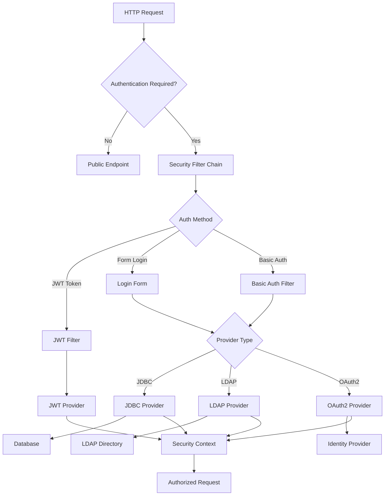
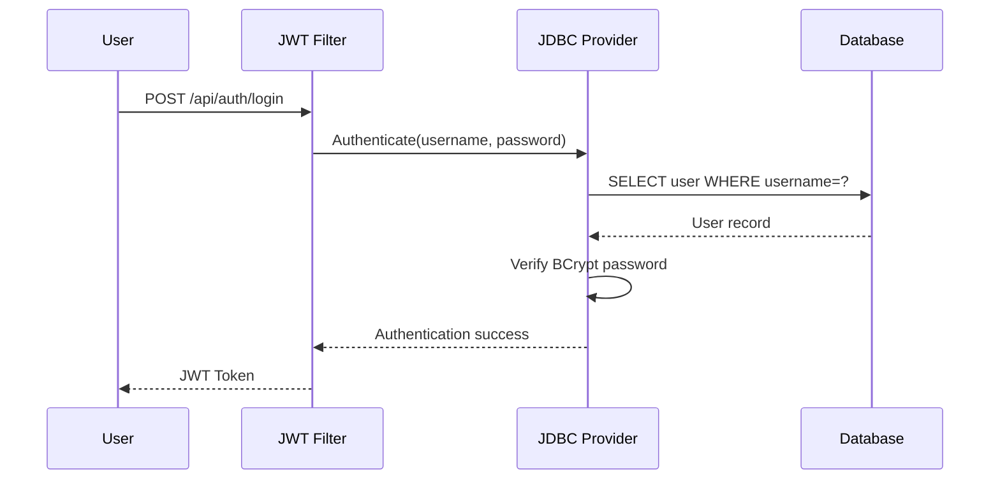
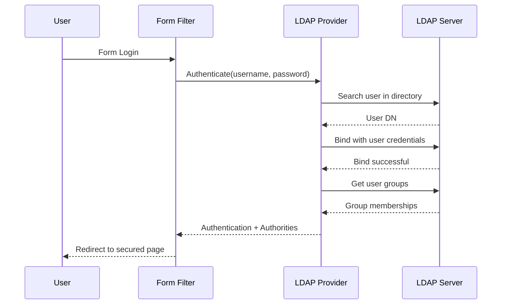
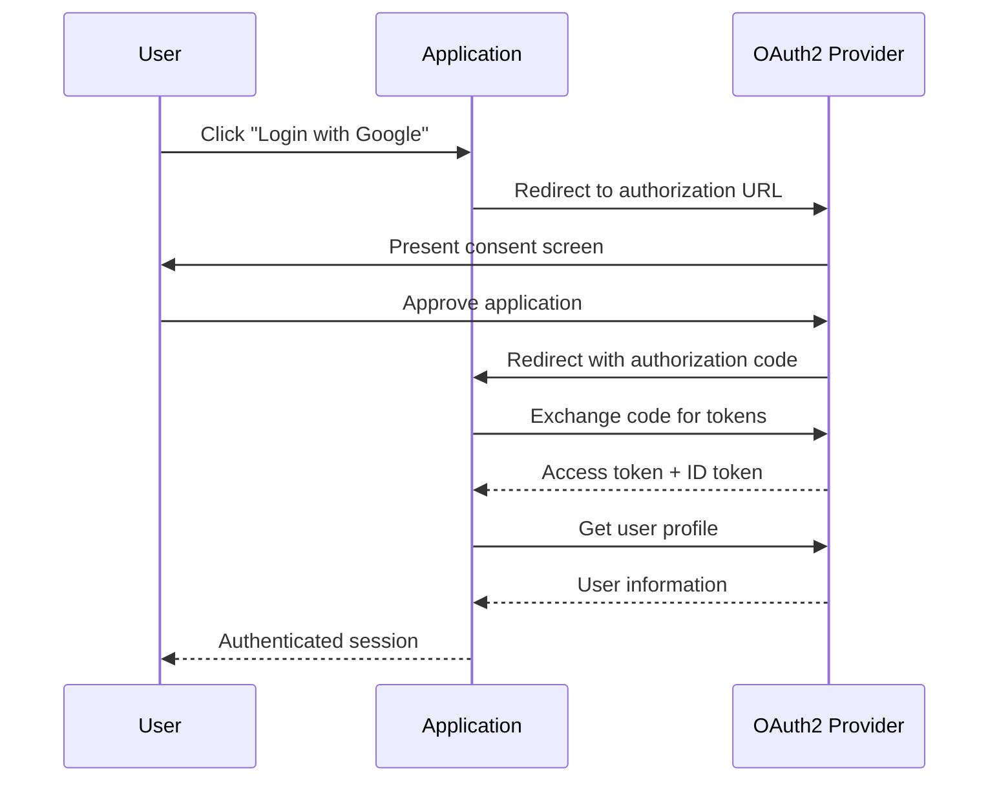

# Authentication Methods

This section covers all authentication methods implemented in the Spring Security Reference Project. Each method demonstrates different use cases and integration patterns commonly found in enterprise applications.

## 🎯 Overview

The project implements **four distinct authentication strategies**, each designed for different scenarios:

| Method | Module | Use Case | Complexity |
|--------|--------|----------|------------|
| **[JDBC Authentication](jdbc-auth.md)** | `jdbc-auth` | Database-backed users | ⭐⭐ |
| **[LDAP Authentication](ldap-auth.md)** | `ldap-auth` | Enterprise directories | ⭐⭐⭐ |
| **[OAuth2 Authentication](oauth2-auth.md)** | `oauth2-auth` | Social login, SSO | ⭐⭐⭐⭐ |
| **[JWT Tokens](jwt-tokens.md)** | `common-auth` | Stateless API auth | ⭐⭐⭐ |

## 🏗️ Authentication Architecture



## 🔄 Authentication Flow

### Standard Flow

Every authentication method follows the same basic pattern:

1. **Request Intercepted**: Security filters examine incoming requests
2. **Credentials Extracted**: Username/password, token, or OAuth2 code
3. **Provider Selection**: Choose appropriate authentication provider
4. **Validation**: Verify credentials against user store
5. **Authorization**: Load user roles and permissions
6. **Security Context**: Set authenticated user in context
7. **Request Processing**: Continue to protected resource

### Flow Variations

Each authentication method has unique characteristics:

#### Database (JDBC) Flow


#### Directory (LDAP) Flow


#### OAuth2 Flow


## 🔧 Configuration Patterns

### Multiple Authentication Providers

The project demonstrates how to combine multiple authentication methods:

```java
@Configuration
public class SecurityConfig {
    
    @Bean
    public AuthenticationManager authenticationManager(
            JdbcAuthenticationProvider jdbcProvider,
            LdapAuthenticationProvider ldapProvider) {
        
        return new ProviderManager(
            Arrays.asList(jdbcProvider, ldapProvider)
        );
    }
}
```

### Profile-Based Configuration

Different authentication methods can be enabled using Spring profiles:

```yaml
# application-jdbc.yml
spring:
  profiles:
    include: jdbc-only
  
# application-ldap.yml  
spring:
  profiles:
    include: ldap-only
```

## 🎓 Learning Path

### Beginner Path
1. **[JDBC Authentication](jdbc-auth.md)** - Start with database auth
2. **[JWT Tokens](jwt-tokens.md)** - Learn stateless authentication
3. **[API Testing](../examples/testing-auth.md)** - Practice with endpoints

### Intermediate Path
1. **[LDAP Authentication](ldap-auth.md)** - Enterprise directory integration
2. **[Security Configuration](../security/index.md)** - Advanced security setup
3. **[Custom Providers](../examples/custom-providers.md)** - Build custom auth

### Advanced Path
1. **[OAuth2 Authentication](oauth2-auth.md)** - Modern identity protocols
2. **[Advanced Patterns](../examples/advanced-patterns.md)** - Complex scenarios
3. **[Production Setup](../deployment/production.md)** - Deploy securely

## 🔍 Comparison Matrix

| Feature | JDBC | LDAP | OAuth2 | JWT |
|---------|------|------|--------|-----|
| **User Storage** | Database | Directory | External Provider | Stateless |
| **Password Management** | Application | Directory | Provider | N/A |
| **Enterprise Integration** | Medium | High | High | High |
| **Scalability** | High | High | Very High | Very High |
| **Setup Complexity** | Low | Medium | High | Low |
| **Offline Capability** | Yes | No | No | Yes |
| **Social Login** | No | No | Yes | N/A |
| **Session State** | Stateful | Stateful | Stateful | Stateless |

## 🔨 Implementation Tips

### Choosing the Right Method

- **JDBC**: Internal applications with custom user management
- **LDAP**: Enterprise environments with existing directories
- **OAuth2**: Public applications or SSO requirements
- **JWT**: APIs, microservices, or stateless architectures

### Best Practices

1. **Security First**: Always use HTTPS in production
2. **Password Policies**: Implement strong password requirements
3. **Token Expiry**: Set appropriate token lifetimes
4. **Logging**: Monitor authentication attempts
5. **Error Handling**: Don't leak sensitive information

### Common Pitfalls

- **Password Storage**: Never store plain text passwords
- **Token Security**: Protect JWT signing keys
- **Session Management**: Consider session fixation attacks
- **Rate Limiting**: Prevent brute force attacks

## 🔗 Next Steps

Ready to dive deeper? Explore specific authentication methods:

- **[JDBC Authentication →](jdbc-auth.md)** Database-backed authentication
- **[LDAP Authentication →](ldap-auth.md)** Directory service integration
- **[OAuth2 Authentication →](oauth2-auth.md)** Modern identity protocols
- **[JWT Tokens →](jwt-tokens.md)** Stateless token authentication

Or explore related topics:

- **[Security Configuration →](../security/index.md)** Learn security setup patterns
- **[API Reference →](../api/index.md)** Test endpoints and flows
- **[Examples & Tutorials →](../examples/index.md)** Practice with real scenarios