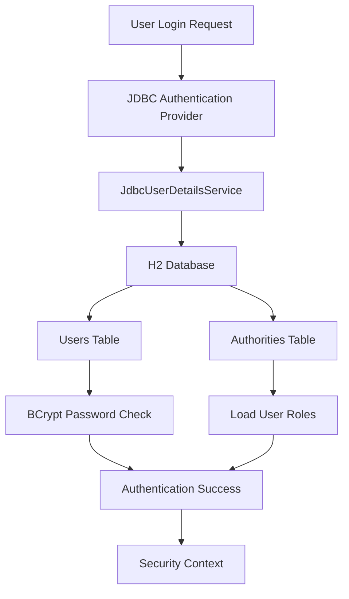
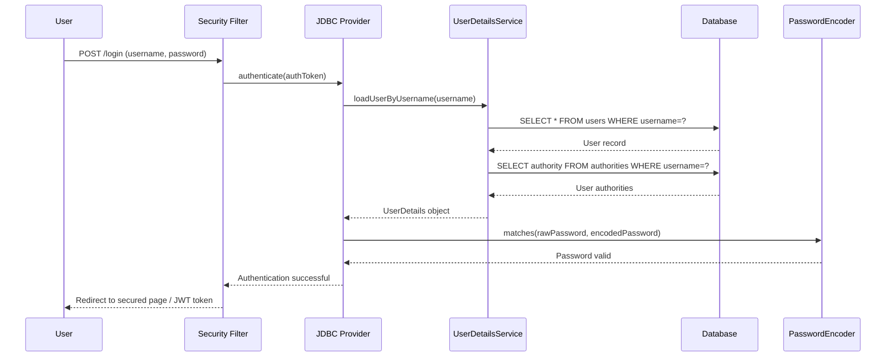

# JDBC Authentication

The `jdbc-auth` module provides database-backed user authentication using Spring Security's built-in JDBC support with BCrypt password encoding and H2 database storage.

## 🎯 Overview

JDBC authentication is ideal for applications that need to manage their own user accounts in a relational database. This implementation demonstrates:

- **Database User Storage**: Users and roles stored in H2 database
- **BCrypt Password Encoding**: Secure password hashing with salt
- **JdbcUserDetailsManager**: Spring Security's standard JDBC user management
- **Auto-initialization**: Demo users created on application startup
- **Standard Schema**: Uses Spring Security's default JDBC schema

## 🏗️ Architecture



## 📊 Database Schema

The module uses Spring Security's standard JDBC schema:

### Users Table
```sql
CREATE TABLE users (
    username VARCHAR(50) NOT NULL PRIMARY KEY,
    password VARCHAR(500) NOT NULL,
    enabled BOOLEAN NOT NULL
);
```

### Authorities Table
```sql
CREATE TABLE authorities (
    username VARCHAR(50) NOT NULL,
    authority VARCHAR(50) NOT NULL,
    CONSTRAINT authorities_idx_1 UNIQUE (username, authority),
    CONSTRAINT authorities_users_fk FOREIGN KEY (username) REFERENCES users (username)
);
```

## 👥 Demo Users

The system automatically creates demo users on startup:

| Username | Password | Role | Permissions |
|----------|----------|------|-------------|
| `jdbcadmin` | `password` | `ROLE_ADMIN` | Full access to all endpoints |
| `jdbcuser` | `password` | `ROLE_USER` | Access to user endpoints only |

## 🔧 Configuration

### JdbcAuthConfig.java

The main configuration class sets up all JDBC authentication components:

```java
@Configuration
@Profile({"default", "jdbc-only"})
public class JdbcAuthConfig {
    
    @Bean
    public PasswordEncoder jdbcPasswordEncoder() {
        return new BCryptPasswordEncoder();
    }

    @Bean
    public UserDetailsService jdbcUserDetailsService(DataSource dataSource) {
        JdbcUserDetailsManager manager = new JdbcUserDetailsManager(dataSource);
        // Custom SQL queries can be configured here
        return manager;
    }

    @Bean
    public DaoAuthenticationProvider jdbcAuthenticationProvider() {
        DaoAuthenticationProvider provider = new DaoAuthenticationProvider();
        provider.setUserDetailsService(jdbcUserDetailsService);
        provider.setPasswordEncoder(jdbcPasswordEncoder);
        return provider;
    }
}
```

### Key Components

#### BCrypt Password Encoder
- **Salt Generation**: Each password gets a unique salt
- **Adaptive Hashing**: Configurable work factor (default: 10)
- **Security**: Resistant to rainbow table attacks

#### JdbcUserDetailsManager
- **CRUD Operations**: Create, read, update, delete users
- **Custom Queries**: Override default SQL queries if needed
- **Group Support**: Optional group-based permissions

#### DaoAuthenticationProvider
- **Password Verification**: Compares provided password with stored hash
- **User Loading**: Retrieves user details from database
- **Authority Mapping**: Loads user roles and permissions

## 🔄 Authentication Flow

### Login Process

1. **User Submits Credentials**: Username and password via form or API
2. **Provider Selection**: Spring Security routes to JDBC provider
3. **User Lookup**: Query database for user record
4. **Password Verification**: BCrypt compares hashes
5. **Authority Loading**: Retrieve user roles from authorities table
6. **Authentication Object**: Create authenticated principal
7. **Security Context**: Store authentication for request

### Detailed Flow Diagram



## 🧪 Testing JDBC Authentication

### Using HTTP Requests

```http
### Test JDBC Admin Login
POST http://localhost:8080/api/auth/login
Content-Type: application/x-www-form-urlencoded

username=jdbcadmin&password=password

### Test JDBC User Login  
POST http://localhost:8080/api/auth/login
Content-Type: application/x-www-form-urlencoded

username=jdbcuser&password=password

### Access Admin Endpoint with JDBC User
GET http://localhost:8080/api/admin/secure
Authorization: Bearer {{jwt_token}}
```

### Using cURL

```bash
# Login as JDBC admin
curl -X POST http://localhost:8080/api/auth/login \
  -d "username=jdbcadmin&password=password"

# Use returned JWT token
curl -H "Authorization: Bearer <jwt-token>" \
  http://localhost:8080/api/admin/secure

# Test JDBC-specific endpoint
curl -H "Authorization: Bearer <jwt-token>" \
  http://localhost:8080/api/jdbc/users
```

## 📚 Educational Logging

The JDBC authentication module includes comprehensive logging to help understand the authentication process:

```java
// Configuration logging
logger.info("🔧 [JDBC-AUTH] Initializing JDBC Authentication Configuration");
logger.debug("📚 [LEARNING] This module provides database-backed user authentication");

// Authentication process logging
logger.info("🔐 [JDBC-AUTH] Creating BCrypt password encoder for database users");
logger.debug("📚 [LEARNING] BCrypt adds salt and hashing for secure password storage");

// User creation logging
logger.info("👤 [JDBC-DATA] Creating regular user: jdbcuser");
logger.debug("🔐 [LEARNING] Same password encoding process as admin user");
```

### Log Analysis

Monitor these log patterns to understand the authentication flow:

- `🔧 [JDBC-AUTH]` - Configuration and setup
- `🔐 [JDBC-AUTH]` - Password and security operations  
- `👤 [JDBC-DATA]` - User management operations
- `📚 [LEARNING]` - Educational explanations

## ⚙️ Customization

### Custom Password Policies

```java
@Bean
public PasswordEncoder customPasswordEncoder() {
    return new BCryptPasswordEncoder(12); // Higher work factor
}
```

### Custom User Schema

```java
@Bean
public UserDetailsService customJdbcUserDetailsService(DataSource dataSource) {
    JdbcUserDetailsManager manager = new JdbcUserDetailsManager(dataSource);
    
    // Custom user query
    manager.setUsersByUsernameQuery(
        "SELECT username, password, active FROM app_users WHERE username = ?"
    );
    
    // Custom authorities query
    manager.setAuthoritiesByUsernameQuery(
        "SELECT username, role FROM user_roles WHERE username = ?"
    );
    
    return manager;
}
```

### Adding New Users Programmatically

```java
@Service
public class UserManagementService {
    
    @Autowired
    private JdbcUserDetailsManager userDetailsManager;
    
    @Autowired 
    private PasswordEncoder passwordEncoder;
    
    public void createUser(String username, String password, String role) {
        UserDetails user = User.builder()
            .username(username)
            .password(passwordEncoder.encode(password))
            .authorities(role)
            .build();
        
        userDetailsManager.createUser(user);
    }
}
```

## 🔒 Security Best Practices

### Password Security
- **Strong Encoding**: Use BCrypt with appropriate work factor
- **Salt Generation**: Each password gets unique salt automatically
- **No Plain Text**: Never store passwords in plain text

### Database Security
- **Connection Pooling**: Use production database connection pools
- **SQL Injection**: JdbcUserDetailsManager uses prepared statements
- **Database Permissions**: Limit database user permissions

### Production Considerations
- **Database Migration**: Use production-grade databases (PostgreSQL, MySQL)
- **Connection Security**: Use encrypted database connections
- **User Management**: Implement user registration and password reset flows

## 🚀 Production Setup

### Database Configuration

```yaml
# application-prod.yml
spring:
  datasource:
    url: jdbc:postgresql://localhost:5432/security_db
    username: ${DB_USERNAME}
    password: ${DB_PASSWORD}
    driver-class-name: org.postgresql.Driver
  
  jpa:
    hibernate:
      ddl-auto: validate
    show-sql: false
```

### Environment Variables

```bash
export DB_USERNAME=security_user
export DB_PASSWORD=secure_password
export BCRYPT_STRENGTH=12
```

## 🔗 Related Topics

- **[Security Configuration](../security/common-security.md)** - How JDBC auth integrates with security config
- **[JWT Tokens](jwt-tokens.md)** - Using JWTs with JDBC authentication
- **[API Testing](../examples/testing-auth.md)** - Testing JDBC auth endpoints
- **[Production Setup](../deployment/production.md)** - Deploying with database authentication