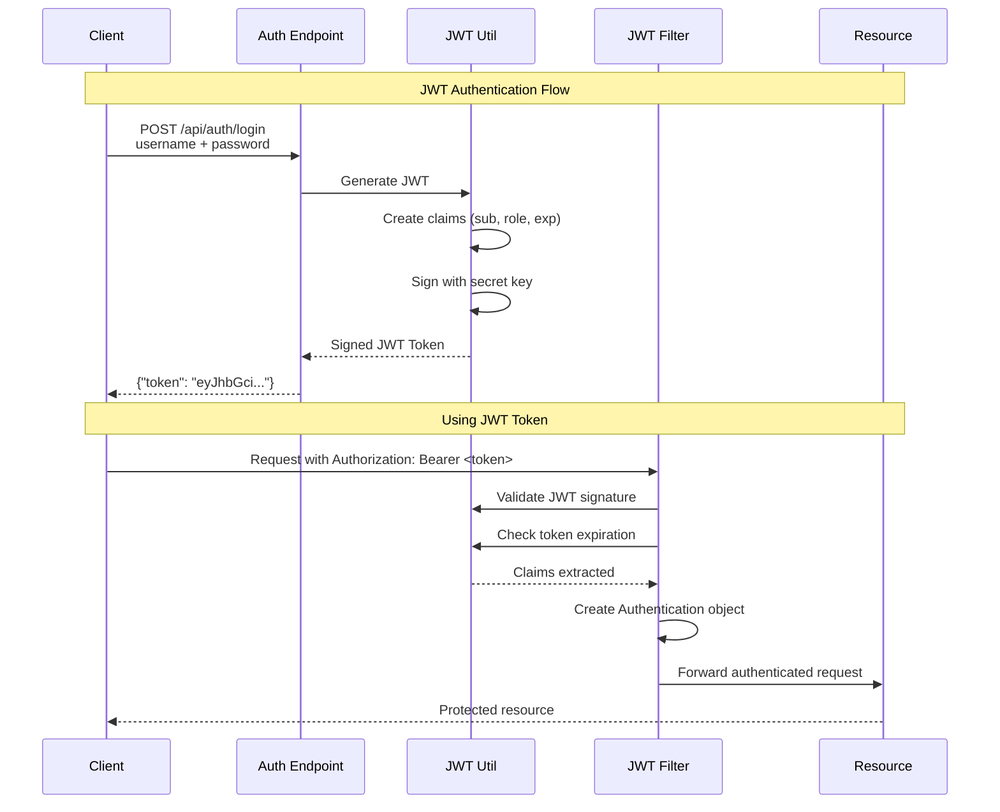

# JWT Tokens

Comprehensive guide to JSON Web Token (JWT) authentication in the Spring Security Reference project. Learn how to generate, validate, and use JWTs for stateless authentication.

## 🎯 **JWT Overview**

JSON Web Tokens (JWTs) provide a stateless authentication mechanism that encodes user identity and claims in a cryptographically signed token.



## 🔧 **JWT Implementation**

### **JwtTokenUtil Class**

```java
@Component
public class JwtTokenUtil {
    
    private static final Logger logger = LogManager.getLogger(JwtTokenUtil.class);
    private static final String SECRET = "MySuperSecretKey";
    private static final int EXPIRATION_TIME = 86400000; // 24 hours
    
    /**
     * Generate JWT token with user claims
     */
    public String generateToken(String username, String role) {
        logger.info("🎟️ [JWT] Generating token for user: {}", username);
        logger.debug("📚 [LEARNING] JWT contains encoded user identity and role claims");
        
        Date now = new Date();
        Date expiryDate = new Date(now.getTime() + EXPIRATION_TIME);
        
        String token = Jwts.builder()
                .setSubject(username)
                .claim("role", role)
                .setIssuedAt(now)
                .setExpiration(expiryDate)
                .signWith(SignatureAlgorithm.HS512, SECRET)
                .compact();
                
        logger.debug("🔐 [JWT] Token generated successfully");
        logger.debug("   • Subject: {}", username);
        logger.debug("   • Role: {}", role);
        logger.debug("   • Expires: {}", expiryDate);
        logger.debug("📚 [LEARNING] Token is signed with HMAC-SHA512");
        
        return token;
    }
    
    /**
     * Extract claims from JWT token
     */
    public Claims getClaimsFromToken(String token) {
        logger.debug("🔍 [JWT] Extracting claims from token");
        
        try {
            Claims claims = Jwts.parser()
                    .setSigningKey(SECRET)
                    .parseClaimsJws(token)
                    .getBody();
                    
            logger.debug("✅ [JWT] Claims extracted successfully");
            logger.debug("   • Subject: {}", claims.getSubject());
            logger.debug("   • Role: {}", claims.get("role"));
            logger.debug("   • Expires: {}", claims.getExpiration());
            
            return claims;
        } catch (ExpiredJwtException e) {
            logger.warn("⏰ [JWT] Token has expired: {}", e.getMessage());
            throw e;
        } catch (JwtException e) {
            logger.warn("❌ [JWT] Invalid token: {}", e.getMessage());
            throw e;
        }
    }
    
    /**
     * Check if JWT token is expired
     */
    public boolean isTokenExpired(String token) {
        try {
            Claims claims = getClaimsFromToken(token);
            boolean expired = claims.getExpiration().before(new Date());
            
            logger.debug("🕒 [JWT] Token expiry check: {}", expired ? "EXPIRED" : "VALID");
            return expired;
        } catch (ExpiredJwtException e) {
            logger.debug("🕒 [JWT] Token is expired");
            return true;
        }
    }
}
```

### **JWT Authentication Filter**

```java
@Component
public class JwtAuthenticationFilter extends OncePerRequestFilter {
    
    private static final Logger logger = LogManager.getLogger(JwtAuthenticationFilter.class);
    
    @Autowired
    private JwtTokenUtil jwtTokenUtil;
    
    @Override
    protected void doFilterInternal(HttpServletRequest request,
                                    HttpServletResponse response,
                                    FilterChain chain) throws ServletException, IOException {
        
        logger.debug("🔍 [JWT-FILTER] Processing request: {}", request.getRequestURI());
        
        String header = request.getHeader("Authorization");
        String jwtToken = null;
        
        // Extract JWT token from Authorization header
        if (header != null && header.startsWith("Bearer ")) {
            jwtToken = header.substring(7);
            logger.debug("🎟️ [JWT-FILTER] JWT token found in request");
            
            try {
                Claims claims = jwtTokenUtil.getClaimsFromToken(jwtToken);
                String username = claims.getSubject();
                String role = claims.get("role", String.class);
                
                if (username != null && SecurityContextHolder.getContext().getAuthentication() == null) {
                    logger.debug("🔐 [JWT-FILTER] Setting authentication for user: {}", username);
                    
                    List<SimpleGrantedAuthority> authorities = List.of(
                            new SimpleGrantedAuthority(role)
                    );
                    
                    UsernamePasswordAuthenticationToken authToken =
                            new UsernamePasswordAuthenticationToken(username, null, authorities);
                    
                    SecurityContextHolder.getContext().setAuthentication(authToken);
                    
                    logger.debug("✅ [JWT-FILTER] Authentication set successfully");
                    logger.debug("📚 [LEARNING] User authenticated via JWT token");
                }
            } catch (ExpiredJwtException e) {
                logger.warn("⏰ [JWT-FILTER] JWT token expired: {}", e.getMessage());
                response.setStatus(HttpServletResponse.SC_UNAUTHORIZED);
                response.getWriter().write("{\"error\": \"JWT token expired\"}");
                return;
            } catch (Exception e) {
                logger.warn("❌ [JWT-FILTER] Invalid JWT token: {}", e.getMessage());
            }
        } else {
            logger.debug("🔍 [JWT-FILTER] No JWT token found in Authorization header");
        }
        
        chain.doFilter(request, response);
    }
}
```

## 🎯 **JWT Token Structure**

### **Header**
```json
{
  "alg": "HS512",
  "typ": "JWT"
}
```

### **Payload (Claims)**
```json
{
  "sub": "admin",
  "role": "ROLE_ADMIN",
  "iat": 1694520000,
  "exp": 1694606400
}
```

### **Signature**
```
HMACSHA512(
  base64UrlEncode(header) + "." + base64UrlEncode(payload),
  "MySuperSecretKey"
)
```

## 🚀 **Usage Examples**

### **1. Generate JWT Token**

```bash
curl -X POST http://localhost:8080/api/auth/login \
  -H "Content-Type: application/x-www-form-urlencoded" \
  -d "username=admin&password=password"
```

**Response:**
```json
{
  "token": "eyJhbGciOiJIUzUxMiJ9.eyJzdWIiOiJhZG1pbiIsInJvbGUiOiJST0xFX0FETUlOIiwiaWF0IjoxNjk0NTIwMDAwLCJleHAiOjE2OTQ2MDY0MDB9.signature",
  "username": "admin",
  "role": "ROLE_ADMIN",
  "message": "Login successful - use this JWT token for authenticated requests"
}
```

### **2. Use JWT Token for API Access**

```bash
# Admin endpoint
curl -H "Authorization: Bearer eyJhbGci..." \
  http://localhost:8080/api/admin/secure

# User endpoint
curl -H "Authorization: Bearer eyJhbGci..." \
  http://localhost:8080/api/user/secure

# Auth info endpoint
curl -H "Authorization: Bearer eyJhbGci..." \
  http://localhost:8080/api/auth/info
```

## 🔐 **Security Configuration**

### **Adding JWT Filter to Security Chain**

```java
@Configuration
@EnableWebSecurity
public class SecurityConfig {
    
    @Autowired
    private JwtAuthenticationFilter jwtAuthenticationFilter;
    
    @Bean
    public SecurityFilterChain filterChain(HttpSecurity http) throws Exception {
        return http
            // Add JWT filter before UsernamePasswordAuthenticationFilter
            .addFilterBefore(jwtAuthenticationFilter, UsernamePasswordAuthenticationFilter.class)
            
            .authorizeHttpRequests(authz -> authz
                .requestMatchers("/api/public/**", "/api/auth/**").permitAll()
                .requestMatchers("/api/admin/**").hasRole("ADMIN")
                .requestMatchers("/api/user/**").hasAnyRole("USER", "ADMIN")
                .anyRequest().authenticated()
            )
            
            // Disable session management for stateless JWT authentication
            .sessionManagement(session -> session
                .sessionCreationPolicy(SessionCreationPolicy.STATELESS)
            )
            
            // Disable CSRF for stateless APIs
            .csrf(csrf -> csrf.disable())
            
            .build();
    }
}
```

## 🧪 **Testing JWT Authentication**

### **Unit Tests**

```java
@ExtendWith(MockitoExtension.class)
class JwtTokenUtilTest {
    
    @InjectMocks
    private JwtTokenUtil jwtTokenUtil;
    
    @Test
    void shouldGenerateValidJwtToken() {
        // Given
        String username = "testuser";
        String role = "ROLE_USER";
        
        // When
        String token = jwtTokenUtil.generateToken(username, role);
        
        // Then
        assertThat(token).isNotNull();
        assertThat(token.split("\\.")).hasSize(3); // header.payload.signature
        
        Claims claims = jwtTokenUtil.getClaimsFromToken(token);
        assertThat(claims.getSubject()).isEqualTo(username);
        assertThat(claims.get("role")).isEqualTo(role);
    }
    
    @Test
    void shouldThrowExceptionForExpiredToken() {
        // Given - create expired token (mock implementation)
        String expiredToken = createExpiredToken();
        
        // When & Then
        assertThatThrownBy(() -> jwtTokenUtil.getClaimsFromToken(expiredToken))
            .isInstanceOf(ExpiredJwtException.class);
    }
}
```

### **Integration Tests**

```java
@SpringBootTest
@AutoConfigureTestDatabase
class JwtAuthenticationIntegrationTest {
    
    @Autowired
    private TestRestTemplate restTemplate;
    
    @Test
    void shouldAuthenticateWithValidJwtToken() {
        // Step 1: Get JWT token
        ResponseEntity<Map> loginResponse = restTemplate.postForEntity(
            "/api/auth/login",
            createLoginRequest("admin", "password"),
            Map.class
        );
        
        String token = (String) loginResponse.getBody().get("token");
        assertThat(token).isNotNull();
        
        // Step 2: Use JWT token to access protected endpoint
        HttpHeaders headers = new HttpHeaders();
        headers.setBearerAuth(token);
        
        ResponseEntity<Map> response = restTemplate.exchange(
            "/api/admin/secure",
            HttpMethod.GET,
            new HttpEntity<>(headers),
            Map.class
        );
        
        assertThat(response.getStatusCode()).isEqualTo(HttpStatus.OK);
        assertThat(response.getBody().get("user")).isEqualTo("admin");
    }
}
```

## ⚡ **JWT Best Practices**

### **✅ Do's**

1. **Use strong secret keys** - Minimum 256-bit keys for HS256
2. **Set appropriate expiration times** - Short-lived tokens (15 minutes to 1 hour)
3. **Implement token refresh mechanism** - Refresh tokens for session management
4. **Validate tokens on every request** - Never trust client-side validation
5. **Use HTTPS in production** - Prevent token interception

### **❌ Don'ts**

1. **Don't store sensitive data** in JWT payload (it's base64 encoded, not encrypted)
2. **Don't use predictable secret keys** - Use cryptographically secure random keys
3. **Don't ignore token expiration** - Always check exp claim
4. **Don't use JWT for session data** - Keep tokens lightweight
5. **Don't use JWT for logout** - Implement token blacklisting if needed

### **🔧 Production Configuration**

```yaml
# application-production.yml
jwt:
  secret: ${JWT_SECRET:} # Use environment variable
  expiration: 3600000    # 1 hour
  refresh-expiration: 86400000 # 24 hours
  issuer: "spring-security-reference"
  
logging:
  level:
    com.example.commonauth.JwtTokenUtil: INFO # Reduce debug logging
```

## 🔄 **Token Refresh Pattern**

```java
@RestController
public class TokenController {
    
    @PostMapping("/api/auth/refresh")
    public ResponseEntity<Map<String, String>> refreshToken(
            @RequestBody Map<String, String> request) {
            
        String refreshToken = request.get("refreshToken");
        
        if (isValidRefreshToken(refreshToken)) {
            String username = extractUsernameFromRefreshToken(refreshToken);
            String role = getUserRole(username);
            
            String newAccessToken = jwtTokenUtil.generateToken(username, role);
            String newRefreshToken = generateRefreshToken(username);
            
            return ResponseEntity.ok(Map.of(
                "accessToken", newAccessToken,
                "refreshToken", newRefreshToken
            ));
        }
        
        return ResponseEntity.status(HttpStatus.UNAUTHORIZED)
            .body(Map.of("error", "Invalid refresh token"));
    }
}
```

## 🚀 **Next Steps**

- **[LDAP Authentication →](ldap-auth.md)** - Directory-based authentication
- **[OAuth2 Authentication →](oauth2-auth.md)** - Social login integration
- **[SSO Integration →](sso-integration.md)** - Single Sign-On patterns
- **[API Reference →](../api/index.md)** - Using JWTs with REST APIs
- **[Security Configuration →](../security/filter-chain.md)** - JWT filter implementation

---

**🎟️ JWT tokens provide stateless authentication perfect for modern APIs and microservices. Understanding token generation, validation, and security best practices is essential for building secure distributed systems.**