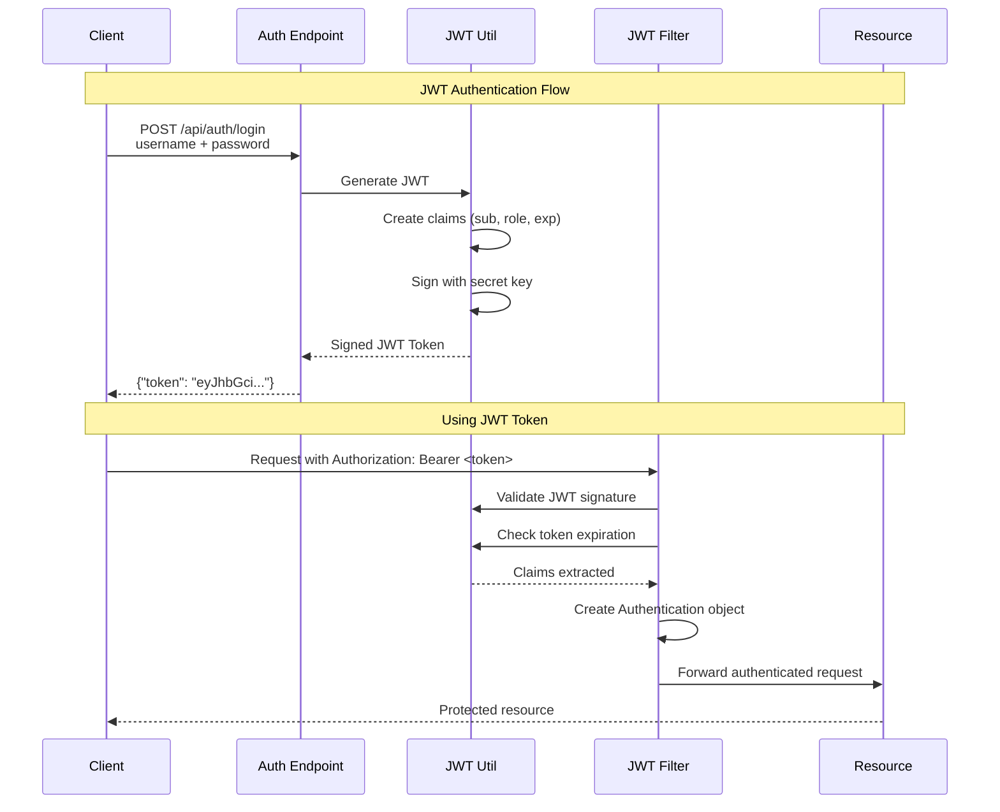

# JWT Tokens

Comprehensive guide to JSON Web Token (JWT) authentication in the Spring Security Reference project. Learn how to generate, validate, and use JWTs for stateless authentication.

## 🎯 **JWT Overview**

JSON Web Tokens (JWTs) provide a stateless authentication mechanism that encodes user identity and claims in a cryptographically signed token.


```mermaid
sequenceDiagram
    participant C as Client
    participant A as Auth Endpoint
    participant J as JWT Util
    participant F as JWT Filter
    participant R as Resource
    
    Note over C,R: JWT Authentication Flow
    C->>A: POST /api/auth/login<br/>username + password
    A->>J: Generate JWT
    J->>J: Create claims (sub, role, exp)
    J->>J: Sign with secret key
    J-->>A: Signed JWT Token
    A-->>C: {"token": "eyJhbGci..."}
    
    Note over C,R: Using JWT Token
    C->>F: Request with Authorization: Bearer <token>
    F->>J: Validate JWT signature
    F->>J: Check token expiration
    J-->>F: Claims extracted
    F->>F: Create Authentication object
    F->>R: Forward authenticated request
    R-->>C: Protected resource
```

## 🔧 **JWT Implementation**

### **JwtTokenUtil Class**

The `JwtTokenUtil` class handles JWT token generation and validation using cryptographically secure keys:

```java
package com.example.spring.security.reference.commonauth;

import io.jsonwebtoken.Claims;
import io.jsonwebtoken.Jwts;
import io.jsonwebtoken.SignatureAlgorithm;
import io.jsonwebtoken.security.Keys;
import org.springframework.stereotype.Component;

import javax.crypto.SecretKey;
import java.util.Date;

/**
 * Utility class for JWT token creation and validation.
 *
 * Uses cryptographically secure keys for HS512 algorithm.
 * The signing key is generated using Keys.secretKeyFor() which ensures
 * the key is at least 512 bits (64 bytes) as required by HS512.
 */
@Component
public class JwtTokenUtil {
    
    // Generate a secure 512-bit key for HS512 algorithm
    // This prevents "WeakKeyException: The signing key's size is X bits 
    // which is not secure enough for the HS512 algorithm"
    private static final SecretKey SECRET_KEY = Keys.secretKeyFor(SignatureAlgorithm.HS512);
    private static final long EXPIRATION_TIME = 86400000; // 24 hours (1 day)
    
    /**
     * Generate JWT token with user claims
     */
    public String generateToken(String username, String role) {
        return Jwts.builder()
                .setSubject(username)
                .claim("role", role)
                .setIssuedAt(new Date())
                .setExpiration(new Date(System.currentTimeMillis() + EXPIRATION_TIME))
                .signWith(SignatureAlgorithm.HS512, SECRET_KEY)
                .compact();
    }
    
    /**
     * Extract claims from JWT token
     */
    public Claims getClaimsFromToken(String token) {
        return Jwts.parser()
                .setSigningKey(SECRET_KEY)
                .parseClaimsJws(token)
                .getBody();
    }
    
    /**
     * Validate JWT token against username
     */
    public boolean validateToken(String token, String username) {
        Claims claims = getClaimsFromToken(token);
        return claims.getSubject().equals(username) 
                && claims.getExpiration().after(new Date());
    }
}
```

!!! warning "Production Consideration"
    The current implementation generates a new secret key on each application restart, 
    which invalidates all previously issued tokens. In production, use a persistent 
    secret key stored securely (e.g., environment variable, secrets manager).

### **JWT Authentication Filter**

The `JwtAuthenticationFilter` intercepts requests and validates JWT tokens:

```java
package com.example.spring.security.reference.commonauth;

import io.jsonwebtoken.Claims;
import jakarta.servlet.FilterChain;
import jakarta.servlet.ServletException;
import jakarta.servlet.http.HttpServletRequest;
import jakarta.servlet.http.HttpServletResponse;
import org.springframework.beans.factory.annotation.Autowired;
import org.springframework.security.authentication.UsernamePasswordAuthenticationToken;
import org.springframework.security.core.authority.SimpleGrantedAuthority;
import org.springframework.security.core.context.SecurityContextHolder;
import org.springframework.security.web.authentication.WebAuthenticationDetailsSource;
import org.springframework.stereotype.Component;
import org.springframework.web.filter.OncePerRequestFilter;

import java.io.IOException;
import java.util.List;

/**
 * Filter that authenticates JWT tokens for incoming requests.
 */
@Component
public class JwtAuthenticationFilter extends OncePerRequestFilter {

    @Autowired
    private JwtTokenUtil jwtTokenUtil;

    @Override
    protected void doFilterInternal(HttpServletRequest request,
                                    HttpServletResponse response,
                                    FilterChain chain) throws ServletException, IOException {

        String header = request.getHeader("Authorization");
        String jwtToken = null;
        String username = null;

        // Extract JWT token from Authorization header
        if (header != null && header.startsWith("Bearer ")) {
            jwtToken = header.substring(7);
            try {
                Claims claims = jwtTokenUtil.getClaimsFromToken(jwtToken);
                username = claims.getSubject();
                String role = claims.get("role", String.class);

                if (username != null && SecurityContextHolder.getContext().getAuthentication() == null) {
                    // Create authorities from role claim
                    List<SimpleGrantedAuthority> authorities = List.of(
                        new SimpleGrantedAuthority(role)
                    );
                    
                    // Create authentication token and set in SecurityContext
                    UsernamePasswordAuthenticationToken authToken =
                            new UsernamePasswordAuthenticationToken(username, null, authorities);
                    authToken.setDetails(new WebAuthenticationDetailsSource().buildDetails(request));
                    SecurityContextHolder.getContext().setAuthentication(authToken);
                }
            } catch (Exception e) {
                // Invalid token - continue without authentication
                logger.debug("Invalid JWT token: " + e.getMessage());
            }
        }
        chain.doFilter(request, response);
    }
}
```

## 🎯 **JWT Token Structure**

### **Header**
```json
{
  "alg": "HS512",
  "typ": "JWT"
}
```

### **Payload (Claims)**
```json
{
  "sub": "admin",
  "role": "ROLE_ADMIN",
  "iat": 1694520000,
  "exp": 1694606400
}
```

| Claim | Description |
|-------|-------------|
| `sub` | Subject - the username |
| `role` | User's role (e.g., `ROLE_ADMIN`, `ROLE_USER`) |
| `iat` | Issued At - timestamp when token was created |
| `exp` | Expiration - timestamp when token expires |

### **Signature**
```
HMACSHA512(
  base64UrlEncode(header) + "." + base64UrlEncode(payload),
  SECRET_KEY
)
```

## 🚀 **Usage Examples**

### **1. Generate JWT Token**

```bash
curl -X POST http://localhost:8080/api/auth/login \
  -H "Content-Type: application/x-www-form-urlencoded" \
  -d "username=admin&password=password"
```

**Response:**
```json
{
  "token": "eyJhbGciOiJIUzUxMiJ9.eyJzdWIiOiJhZG1pbiIsInJvbGUiOiJST0xFX0FETUlOIiwiaWF0IjoxNjk0NTIwMDAwLCJleHAiOjE2OTQ2MDY0MDB9.signature",
  "username": "admin",
  "role": "ROLE_ADMIN",
  "message": "Login successful - use this JWT token for authenticated requests",
  "usage": "Add header: Authorization: Bearer eyJhbGciOi..."
}
```

### **2. Use JWT Token for API Access**

```bash
# Store token in variable
export JWT_TOKEN="eyJhbGciOiJIUzUxMiJ9..."

# Admin endpoint (requires ROLE_ADMIN)
curl -H "Authorization: Bearer $JWT_TOKEN" \
  http://localhost:8080/api/admin/secure

# User endpoint (requires ROLE_USER or ROLE_ADMIN)
curl -H "Authorization: Bearer $JWT_TOKEN" \
  http://localhost:8080/api/user/secure

# Auth info endpoint (any authenticated user)
curl -H "Authorization: Bearer $JWT_TOKEN" \
  http://localhost:8080/api/auth/info
```

### **3. Test Different User Roles**

```bash
# Login as regular user
curl -X POST http://localhost:8080/api/auth/login \
  -d "username=user&password=password"

# User token can access /api/user/** but NOT /api/admin/**
export USER_TOKEN="eyJhbGci..."

# This works (ROLE_USER can access user endpoints)
curl -H "Authorization: Bearer $USER_TOKEN" \
  http://localhost:8080/api/user/secure

# This returns 403 Forbidden (ROLE_USER cannot access admin endpoints)
curl -H "Authorization: Bearer $USER_TOKEN" \
  http://localhost:8080/api/admin/secure
```

## 🔐 **Security Configuration**

### **Adding JWT Filter to Security Chain**

The JWT filter is added **before** `UsernamePasswordAuthenticationFilter` in `MultiAuthSecurityConfig`:

```java
@Configuration
@EnableWebSecurity
public class MultiAuthSecurityConfig {

    @Autowired
    private JwtAuthenticationFilter jwtAuthenticationFilter;

    @Bean
    public SecurityFilterChain defaultFilterChain(HttpSecurity http) throws Exception {
        http
            .csrf(csrf -> csrf.disable())
            .sessionManagement(session -> session.sessionCreationPolicy(SessionCreationPolicy.STATELESS))
            .authorizeHttpRequests(authz -> authz
                .requestMatchers("/api/public/**", "/api/auth/**").permitAll()
                .requestMatchers("/api/admin/**").hasRole("ADMIN")
                .requestMatchers("/api/user/**").hasAnyRole("USER", "ADMIN")
                .anyRequest().authenticated()
            )
            // JWT filter runs before username/password authentication
            .addFilterBefore(jwtAuthenticationFilter, UsernamePasswordAuthenticationFilter.class);

        return http.build();
    }
}
```

## 🎓 **Learning Points**

| Concept | Description |
|---------|-------------|
| **Stateless Sessions** | JWT enables stateless authentication - no server-side session storage needed |
| **Filter Order** | JWT filter must run early to authenticate before authorization checks |
| **Claims** | JWT payload contains user identity and role information |
| **Signature** | HMAC-SHA512 ensures token integrity and authenticity |
| **Expiration** | Tokens automatically expire after 24 hours (configurable) |

## ⚠️ **Security Best Practices**

1. **Use HTTPS**: Always transmit JWT tokens over encrypted connections
2. **Secure Key Storage**: Store signing keys in environment variables or secrets managers
3. **Short Expiration**: Use shorter expiration times for sensitive applications
4. **Token Refresh**: Implement refresh token mechanism for long-lived sessions
5. **Revocation**: Consider implementing token blacklisting for logout functionality

## 🔗 **Related Topics**

- [Security Filter Chain](../security/filter-chain.md)
- [REST Endpoints](../api/rest-endpoints.md)
- [API Testing Guide](../examples/testing-api.md)
