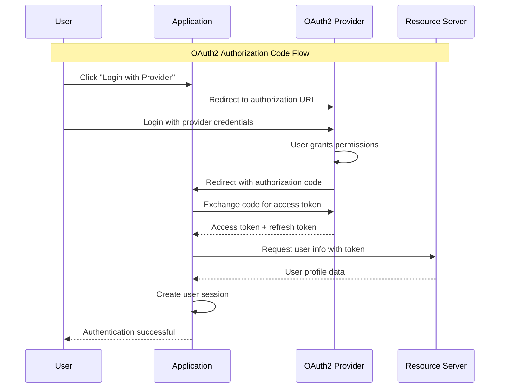

# OAuth2 Authentication

Comprehensive guide to OAuth2 authentication in Spring Security. Learn how to integrate with social login providers like Google, GitHub, and Facebook for modern authentication flows.

## 🌐 **OAuth2 Overview**

OAuth2 enables secure third-party authentication without exposing user credentials to your application. Users authenticate with trusted providers and grant limited access to your app.



## 🔧 **OAuth2 Configuration**

### **OAuth2 Client Setup**

```java
@Configuration
@EnableOAuth2Client
@Profile("oauth2")
public class OAuth2Config {
    
    private static final Logger logger = LogManager.getLogger(OAuth2Config.class);
    
    @Bean
    public ClientRegistrationRepository clientRegistrationRepository() {
        logger.info("🌐 [OAUTH2-CONFIG] Setting up OAuth2 client registrations");
        logger.debug("📚 [LEARNING] OAuth2 allows third-party authentication providers");
        
        return new InMemoryClientRegistrationRepository(
                googleClientRegistration(),
                githubClientRegistration(),
                facebookClientRegistration()
        );
    }
    
    @Bean
    public OAuth2AuthorizedClientService authorizedClientService() {
        return new InMemoryOAuth2AuthorizedClientService(clientRegistrationRepository());
    }
    
    @Bean
    public OAuth2AuthorizedClientManager authorizedClientManager() {
        OAuth2AuthorizedClientProvider authorizedClientProvider =
                OAuth2AuthorizedClientProviderBuilder.builder()
                        .authorizationCode()
                        .refreshToken()
                        .build();
                        
        DefaultOAuth2AuthorizedClientManager authorizedClientManager =
                new DefaultOAuth2AuthorizedClientManager(
                        clientRegistrationRepository(),
                        authorizedClientService()
                );
                
        authorizedClientManager.setAuthorizedClientProvider(authorizedClientProvider);
        
        logger.debug("✅ [OAUTH2-CONFIG] OAuth2 client manager configured");
        
        return authorizedClientManager;
    }
}
```

### **OAuth2 Client Registrations**

```java
private ClientRegistration googleClientRegistration() {
    logger.debug("🔐 [OAUTH2-CONFIG] Configuring Google OAuth2 client");
    
    return ClientRegistration.withRegistrationId("google")
            .clientId("${oauth2.google.client-id}")
            .clientSecret("${oauth2.google.client-secret}")
            .clientAuthenticationMethod(ClientAuthenticationMethod.CLIENT_SECRET_BASIC)
            .authorizationGrantType(AuthorizationGrantType.AUTHORIZATION_CODE)
            .redirectUri("{baseUrl}/login/oauth2/code/{registrationId}")
            .scope("openid", "profile", "email")
            .authorizationUri("https://accounts.google.com/o/oauth2/v2/auth")
            .tokenUri("https://oauth2.googleapis.com/token")
            .userInfoUri("https://www.googleapis.com/oauth2/v3/userinfo")
            .userNameAttributeName(IdTokenClaimNames.SUB)
            .jwkSetUri("https://www.googleapis.com/oauth2/v3/certs")
            .clientName("Google")
            .build();
}

private ClientRegistration githubClientRegistration() {
    logger.debug("🔐 [OAUTH2-CONFIG] Configuring GitHub OAuth2 client");
    
    return ClientRegistration.withRegistrationId("github")
            .clientId("${oauth2.github.client-id}")
            .clientSecret("${oauth2.github.client-secret}")
            .clientAuthenticationMethod(ClientAuthenticationMethod.CLIENT_SECRET_BASIC)
            .authorizationGrantType(AuthorizationGrantType.AUTHORIZATION_CODE)
            .redirectUri("{baseUrl}/login/oauth2/code/{registrationId}")
            .scope("read:user")
            .authorizationUri("https://github.com/login/oauth/authorize")
            .tokenUri("https://github.com/login/oauth/access_token")
            .userInfoUri("https://api.github.com/user")
            .userNameAttributeName("id")
            .clientName("GitHub")
            .build();
}

private ClientRegistration facebookClientRegistration() {
    logger.debug("🔐 [OAUTH2-CONFIG] Configuring Facebook OAuth2 client");
    
    return ClientRegistration.withRegistrationId("facebook")
            .clientId("${oauth2.facebook.client-id}")
            .clientSecret("${oauth2.facebook.client-secret}")
            .clientAuthenticationMethod(ClientAuthenticationMethod.CLIENT_SECRET_POST)
            .authorizationGrantType(AuthorizationGrantType.AUTHORIZATION_CODE)
            .redirectUri("{baseUrl}/login/oauth2/code/{registrationId}")
            .scope("email", "public_profile")
            .authorizationUri("https://www.facebook.com/v18.0/dialog/oauth")
            .tokenUri("https://graph.facebook.com/v18.0/oauth/access_token")
            .userInfoUri("https://graph.facebook.com/me?fields=id,name,email")
            .userNameAttributeName("id")
            .clientName("Facebook")
            .build();
}
```

## 🔐 **Security Configuration**

### **OAuth2 Security Filter Chain**

```java
@Configuration
@EnableWebSecurity
@Profile("oauth2")
public class OAuth2SecurityConfig {
    
    private static final Logger logger = LogManager.getLogger(OAuth2SecurityConfig.class);
    
    @Autowired
    private OAuth2UserService<OAuth2UserRequest, OAuth2User> customOAuth2UserService;
    
    @Bean
    public SecurityFilterChain oauth2FilterChain(HttpSecurity http) throws Exception {
        logger.info("🔐 [OAUTH2-SECURITY] Configuring OAuth2 security filter chain");
        logger.debug("📚 [LEARNING] OAuth2 login with social providers");
        
        return http
            .authorizeHttpRequests(authz -> authz
                .requestMatchers("/", "/login", "/oauth2/**", "/api/public/**").permitAll()
                .requestMatchers("/api/oauth2/**").authenticated()
                .requestMatchers("/api/admin/**").hasRole("ADMIN")
                .requestMatchers("/api/user/**").hasAnyRole("USER", "ADMIN")
                .anyRequest().authenticated()
            )
            
            .oauth2Login(oauth2 -> oauth2
                .loginPage("/login")
                .defaultSuccessUrl("/api/oauth2/success")
                .failureUrl("/login?error")
                .userInfoEndpoint(userInfo -> userInfo
                    .userService(customOAuth2UserService)
                )\n            )\n            \n            .logout(logout -> logout\n                .logoutUrl(\"/logout\")\n                .logoutSuccessUrl(\"/\")\n                .invalidateHttpSession(true)\n                .clearAuthentication(true)\n            )\n            \n            .sessionManagement(session -> session\n                .sessionCreationPolicy(SessionCreationPolicy.IF_REQUIRED)\n                .maximumSessions(1)\n                .maxSessionsPreventsLogin(false)\n            )\n            \n            .csrf(csrf -> csrf.disable())\n            \n            .build();\n    }\n}\n```\n\n## 🎯 **Custom OAuth2 User Service**\n\n### **OAuth2UserService Implementation**\n\n```java\n@Service\npublic class CustomOAuth2UserService implements OAuth2UserService<OAuth2UserRequest, OAuth2User> {\n    \n    private static final Logger logger = LogManager.getLogger(CustomOAuth2UserService.class);\n    \n    private final DefaultOAuth2UserService delegate = new DefaultOAuth2UserService();\n    \n    @Override\n    public OAuth2User loadUser(OAuth2UserRequest userRequest) throws OAuth2AuthenticationException {\n        OAuth2User oauth2User = delegate.loadUser(userRequest);\n        \n        String registrationId = userRequest.getClientRegistration().getRegistrationId();\n        String userNameAttributeName = userRequest.getClientRegistration()\n                .getProviderDetails().getUserInfoEndpoint().getUserNameAttributeName();\n                \n        logger.info(\"🌐 [OAUTH2-USER] Loading OAuth2 user from provider: {}\", registrationId);\n        logger.debug(\"📊 [OAUTH2-USER] User name attribute: {}\", userNameAttributeName);\n        \n        // Extract user information based on provider\n        OAuth2UserInfo userInfo = OAuth2UserInfoFactory.getOAuth2UserInfo(\n                registrationId, \n                oauth2User.getAttributes()\n        );\n        \n        logger.debug(\"👤 [OAUTH2-USER] User info extracted:\");\n        logger.debug(\"   • ID: {}\", userInfo.getId());\n        logger.debug(\"   • Name: {}\", userInfo.getName());\n        logger.debug(\"   • Email: {}\", userInfo.getEmail());\n        \n        // Check if user exists in database, create if not\n        User user = createOrUpdateUser(userInfo, registrationId);\n        \n        // Create custom principal with user details\n        return new CustomOAuth2User(\n                oauth2User.getAuthorities(),\n                oauth2User.getAttributes(),\n                userNameAttributeName,\n                user\n        );\n    }\n    \n    private User createOrUpdateUser(OAuth2UserInfo userInfo, String provider) {\n        logger.debug(\"🔄 [OAUTH2-USER] Creating/updating user for provider: {}\", provider);\n        \n        // Implementation for user creation/update logic\n        User user = User.builder()\n                .providerId(userInfo.getId())\n                .provider(provider)\n                .name(userInfo.getName())\n                .email(userInfo.getEmail())\n                .role(\"ROLE_USER\") // Default role\n                .enabled(true)\n                .build();\n                \n        logger.debug(\"✅ [OAUTH2-USER] User created/updated successfully\");\n        return user;\n    }\n}\n```\n\n### **OAuth2 User Info Factory**\n\n```java\npublic class OAuth2UserInfoFactory {\n    \n    public static OAuth2UserInfo getOAuth2UserInfo(String registrationId, \n                                                   Map<String, Object> attributes) {\n        \n        return switch (registrationId.toLowerCase()) {\n            case \"google\" -> new GoogleOAuth2UserInfo(attributes);\n            case \"github\" -> new GitHubOAuth2UserInfo(attributes);\n            case \"facebook\" -> new FacebookOAuth2UserInfo(attributes);\n            default -> throw new OAuth2AuthenticationProcessingException(\n                    \"Login with \" + registrationId + \" is not supported\");\n        };\n    }\n}\n\n// Provider-specific user info classes\npublic class GoogleOAuth2UserInfo extends OAuth2UserInfo {\n    \n    public GoogleOAuth2UserInfo(Map<String, Object> attributes) {\n        super(attributes);\n    }\n    \n    @Override\n    public String getId() {\n        return (String) attributes.get(\"sub\");\n    }\n    \n    @Override\n    public String getName() {\n        return (String) attributes.get(\"name\");\n    }\n    \n    @Override\n    public String getEmail() {\n        return (String) attributes.get(\"email\");\n    }\n    \n    @Override\n    public String getImageUrl() {\n        return (String) attributes.get(\"picture\");\n    }\n}\n```\n\n## 🚀 **Usage Examples**\n\n### **1. OAuth2 Login Endpoints**\n\n```bash\n# Initiate Google OAuth2 login\ncurl -v http://localhost:8080/oauth2/authorization/google\n\n# Initiate GitHub OAuth2 login\ncurl -v http://localhost:8080/oauth2/authorization/github\n\n# Initiate Facebook OAuth2 login\ncurl -v http://localhost:8080/oauth2/authorization/facebook\n```\n\n### **2. OAuth2 User Info Endpoint**\n\n```java\n@RestController\n@RequestMapping(\"/api/oauth2\")\npublic class OAuth2Controller {\n    \n    @GetMapping(\"/user\")\n    public ResponseEntity<Map<String, Object>> getCurrentUser(\n            @AuthenticationPrincipal OAuth2User principal) {\n        \n        Map<String, Object> userInfo = new HashMap<>();\n        userInfo.put(\"name\", principal.getAttribute(\"name\"));\n        userInfo.put(\"email\", principal.getAttribute(\"email\"));\n        userInfo.put(\"provider\", getProvider(principal));\n        userInfo.put(\"authorities\", principal.getAuthorities());\n        \n        return ResponseEntity.ok(userInfo);\n    }\n    \n    @GetMapping(\"/success\")\n    public ResponseEntity<Map<String, Object>> loginSuccess(\n            Authentication authentication) {\n            \n        OAuth2User oauth2User = (OAuth2User) authentication.getPrincipal();\n        \n        return ResponseEntity.ok(Map.of(\n            \"message\", \"OAuth2 login successful\",\n            \"user\", oauth2User.getAttribute(\"name\"),\n            \"email\", oauth2User.getAttribute(\"email\"),\n            \"provider\", getProvider(oauth2User)\n        ));\n    }\n}\n```\n\n### **3. OAuth2 Response Example**\n\n```json\n{\n  \"message\": \"OAuth2 login successful\",\n  \"user\": \"John Doe\",\n  \"email\": \"john.doe@example.com\",\n  \"provider\": \"google\",\n  \"authorities\": [\n    {\n      \"authority\": \"ROLE_USER\"\n    },\n    {\n      \"authority\": \"OAUTH2_USER\"\n    }\n  ],\n  \"attributes\": {\n    \"sub\": \"123456789\",\n    \"name\": \"John Doe\",\n    \"email\": \"john.doe@example.com\",\n    \"picture\": \"https://example.com/avatar.jpg\"\n  }\n}\n```\n\n## 🔧 **Configuration Properties**\n\n### **Application Properties**\n\n```yaml\n# application-oauth2.yml\nspring:\n  security:\n    oauth2:\n      client:\n        registration:\n          google:\n            client-id: ${GOOGLE_CLIENT_ID}\n            client-secret: ${GOOGLE_CLIENT_SECRET}\n            scope:\n              - openid\n              - profile\n              - email\n            redirect-uri: \"{baseUrl}/login/oauth2/code/{registrationId}\"\n          \n          github:\n            client-id: ${GITHUB_CLIENT_ID}\n            client-secret: ${GITHUB_CLIENT_SECRET}\n            scope:\n              - read:user\n              - user:email\n            redirect-uri: \"{baseUrl}/login/oauth2/code/{registrationId}\"\n          \n          facebook:\n            client-id: ${FACEBOOK_CLIENT_ID}\n            client-secret: ${FACEBOOK_CLIENT_SECRET}\n            scope:\n              - email\n              - public_profile\n            redirect-uri: \"{baseUrl}/login/oauth2/code/{registrationId}\"\n        \n        provider:\n          facebook:\n            authorization-uri: https://www.facebook.com/v18.0/dialog/oauth\n            token-uri: https://graph.facebook.com/v18.0/oauth/access_token\n            user-info-uri: https://graph.facebook.com/me?fields=id,name,email\n            user-name-attribute: id\n\nlogging:\n  level:\n    org.springframework.security.oauth2: DEBUG\n    com.example.oauth2: DEBUG\n```\n\n## 🧪 **Testing OAuth2 Authentication**\n\n### **Integration Tests**\n\n```java\n@SpringBootTest(webEnvironment = SpringBootTest.WebEnvironment.RANDOM_PORT)\n@ActiveProfiles(\"oauth2\")\nclass OAuth2AuthenticationTest {\n    \n    @Autowired\n    private TestRestTemplate restTemplate;\n    \n    @Autowired\n    private ClientRegistrationRepository clientRegistrationRepository;\n    \n    @Test\n    void shouldHaveOAuth2ClientRegistrations() {\n        // Test OAuth2 client registrations are configured\n        ClientRegistration google = clientRegistrationRepository.findByRegistrationId(\"google\");\n        ClientRegistration github = clientRegistrationRepository.findByRegistrationId(\"github\");\n        ClientRegistration facebook = clientRegistrationRepository.findByRegistrationId(\"facebook\");\n        \n        assertThat(google).isNotNull();\n        assertThat(github).isNotNull();\n        assertThat(facebook).isNotNull();\n        \n        assertThat(google.getClientName()).isEqualTo(\"Google\");\n        assertThat(github.getClientName()).isEqualTo(\"GitHub\");\n        assertThat(facebook.getClientName()).isEqualTo(\"Facebook\");\n    }\n    \n    @Test\n    void shouldRedirectToOAuth2Provider() {\n        // Test OAuth2 authorization redirection\n        ResponseEntity<String> response = restTemplate.getForEntity(\n                \"/oauth2/authorization/google\", \n                String.class\n        );\n        \n        assertThat(response.getStatusCode()).isEqualTo(HttpStatus.FOUND);\n        assertThat(response.getHeaders().getLocation().toString())\n                .contains(\"accounts.google.com/o/oauth2/v2/auth\");\n    }\n}\n```\n\n### **Mock OAuth2 User Tests**\n\n```java\n@Test\n@WithMockOAuth2User(value = \"123456789\", attributes = {\n    \"sub\", \"123456789\",\n    \"name\", \"Test User\",\n    \"email\", \"test@example.com\"\n})\nvoid shouldAuthenticateWithMockOAuth2User() {\n    ResponseEntity<Map> response = restTemplate.getForEntity(\n            \"/api/oauth2/user\", \n            Map.class\n    );\n    \n    assertThat(response.getStatusCode()).isEqualTo(HttpStatus.OK);\n    assertThat(response.getBody().get(\"name\")).isEqualTo(\"Test User\");\n    assertThat(response.getBody().get(\"email\")).isEqualTo(\"test@example.com\");\n}\n```\n\n## 🔄 **OAuth2 Token Management**\n\n### **Token Refresh**\n\n```java\n@Component\npublic class OAuth2TokenRefreshService {\n    \n    private final OAuth2AuthorizedClientManager authorizedClientManager;\n    \n    public String refreshAccessToken(String clientRegistrationId, String principalName) {\n        OAuth2AuthorizeRequest authorizeRequest = OAuth2AuthorizeRequest\n                .withClientRegistrationId(clientRegistrationId)\n                .principal(principalName)\n                .build();\n                \n        OAuth2AuthorizedClient authorizedClient = \n                authorizedClientManager.authorize(authorizeRequest);\n                \n        if (authorizedClient != null && authorizedClient.getAccessToken() != null) {\n            return authorizedClient.getAccessToken().getTokenValue();\n        }\n        \n        throw new IllegalStateException(\"Unable to refresh OAuth2 token\");\n    }\n}\n```\n\n### **Token Storage**\n\n```java\n@Bean\npublic OAuth2AuthorizedClientService authorizedClientService() {\n    // Use JdbcOAuth2AuthorizedClientService for persistent token storage\n    return new JdbcOAuth2AuthorizedClientService(\n            jdbcTemplate,\n            clientRegistrationRepository()\n    );\n}\n```\n\n## ⚡ **OAuth2 Best Practices**\n\n### **✅ Do's**\n\n1. **Use HTTPS in production** - OAuth2 requires secure communication\n2. **Validate redirect URIs** - Prevent authorization code interception\n3. **Implement proper scopes** - Request minimal required permissions\n4. **Store tokens securely** - Use encrypted storage for access/refresh tokens\n5. **Handle token expiration** - Implement automatic token refresh\n\n### **❌ Don'ts**\n\n1. **Don't store client secrets** in source code or client-side applications\n2. **Don't use implicit flow** - Use authorization code flow with PKCE\n3. **Don't ignore state parameters** - Prevent CSRF attacks\n4. **Don't trust client-side tokens** - Always validate tokens server-side\n5. **Don't expose sensitive scopes** - Limit access to necessary data only\n\n### **🔧 Production Configuration**\n\n```yaml\n# application-production.yml\nspring:\n  security:\n    oauth2:\n      client:\n        registration:\n          google:\n            client-id: ${GOOGLE_OAUTH2_CLIENT_ID}\n            client-secret: ${GOOGLE_OAUTH2_CLIENT_SECRET}\n            \nlogging:\n  level:\n    org.springframework.security.oauth2: INFO # Reduce debug logging\n    \n# Environment variables for production\n# GOOGLE_OAUTH2_CLIENT_ID=your-google-client-id\n# GOOGLE_OAUTH2_CLIENT_SECRET=your-google-client-secret\n# GITHUB_OAUTH2_CLIENT_ID=your-github-client-id\n# GITHUB_OAUTH2_CLIENT_SECRET=your-github-client-secret\n```\n\n## 🚀 **Next Steps**\n\n- **[SSO Integration →](sso-integration.md)** - Enterprise single sign-on\n- **[JWT Tokens →](jwt-tokens.md)** - Combine OAuth2 with JWT\n- **[LDAP Authentication →](ldap-auth.md)** - Directory-based authentication\n- **[API Reference →](../api/auth-flow.md)** - OAuth2 API patterns\n- **[Security Configuration →](../security/index.md)** - OAuth2 security setup\n\n---\n\n**🌐 OAuth2 authentication enables modern social login flows while maintaining security and user privacy. Understanding provider integration and token management is essential for contemporary web applications.**