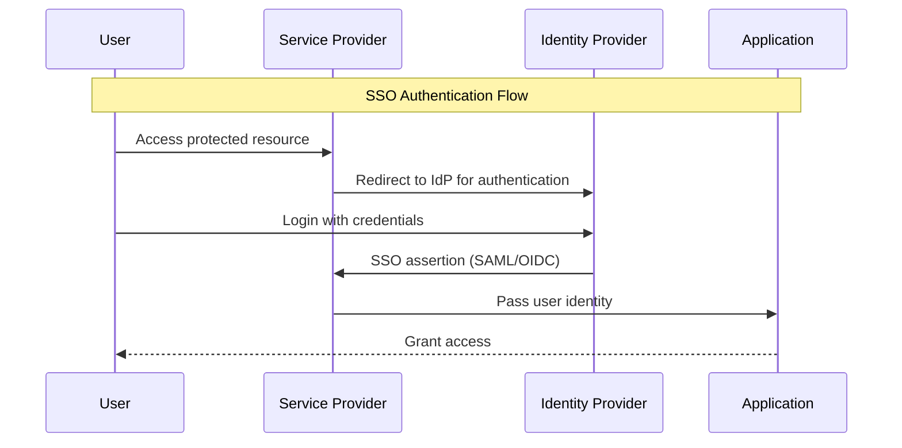

# SSO Integration

Comprehensive guide to Single Sign-On (SSO) integration in Spring Security. Learn how to enable seamless authentication across multiple applications using SAML, OAuth2, or OpenID Connect.

## 🔑 **SSO Overview**

Single Sign-On (SSO) allows users to authenticate once and gain access to multiple independent systems without repeated logins. SSO is commonly implemented using protocols like SAML, OAuth2, or OpenID Connect.



## 🔧 **SSO Implementation Patterns**

### **1. SAML SSO Integration**

- Use Spring Security SAML extension for SAML 2.0 support
- Configure Service Provider (SP) and Identity Provider (IdP) metadata
- Handle SAML assertions and map user roles

### **2. OAuth2/OpenID Connect SSO**

- Use Spring Security OAuth2 client for OIDC flows
- Configure trusted IdP (e.g., Azure AD, Google Workspace)
- Map OIDC claims to application roles

## 🔐 **Security Configuration Example**

### **SAML SSO Filter Chain**

```java
@Configuration
@EnableWebSecurity
@Profile("sso")
public class SsoSecurityConfig {
    @Bean
    public SecurityFilterChain ssoFilterChain(HttpSecurity http) throws Exception {
        return http
            .authorizeHttpRequests(authz -> authz
                .requestMatchers("/sso/**").authenticated()
                .anyRequest().permitAll()
            )
            .saml2Login(saml2 -> saml2
                .loginPage("/sso/login")
                .defaultSuccessUrl("/sso/success")
            )
            .build();
    }
}
```

### **OIDC SSO Filter Chain**

```java
@Configuration
@EnableWebSecurity
@Profile("sso-oidc")
public class OidcSsoSecurityConfig {
    @Bean
    public SecurityFilterChain oidcSsoFilterChain(HttpSecurity http) throws Exception {
        return http
            .authorizeHttpRequests(authz -> authz
                .requestMatchers("/sso/**").authenticated()
                .anyRequest().permitAll()
            )
            .oauth2Login(oauth2 -> oauth2
                .loginPage("/sso/login")
                .defaultSuccessUrl("/sso/success")
            )
            .build();
    }
}
```

## 🚀 **Usage Examples**

### **1. SSO Login Endpoint**

```bash
curl -v http://localhost:8080/sso/login
```

### **2. SSO Success Endpoint**

```java
@RestController
@RequestMapping("/sso")
public class SsoController {
    @GetMapping("/success")
    public ResponseEntity<Map<String, Object>> ssoSuccess(Authentication authentication) {
        Map<String, Object> userInfo = new HashMap<>();
        userInfo.put("name", authentication.getName());
        userInfo.put("authorities", authentication.getAuthorities());
        userInfo.put("details", authentication.getDetails());
        return ResponseEntity.ok(userInfo);
    }
}
```

## 🧪 **Testing SSO Integration**

- Use SAML/OIDC test IdPs (e.g., [SSOCircle](https://www.ssocircle.com/), [Google Workspace](https://workspace.google.com/))
- Validate SSO login, role mapping, and session propagation

## ⚡ **SSO Best Practices**

### **✅ Do's**

1. Use trusted identity providers (IdPs)
2. Map SSO claims to application roles
3. Implement session timeout and logout propagation
4. Use HTTPS for all SSO endpoints
5. Log SSO authentication events for auditing

### **❌ Don'ts**

1. Don't hardcode IdP credentials
2. Don't ignore SSO assertion validation
3. Don't expose sensitive SSO endpoints
4. Don't skip logout propagation

## 🚀 **Next Steps**

- **[JWT Tokens →](jwt-tokens.md)** - Combine SSO with JWT for distributed systems
- **[OAuth2 Authentication →](oauth2-auth.md)** - Social login integration
- **[LDAP Authentication →](ldap-auth.md)** - Directory-based authentication
- **[API Reference →](../api/auth-flow.md)** - SSO API patterns
- **[Security Configuration →](../security/index.md)** - SSO security setup

---

**🔑 SSO integration enables seamless authentication across multiple applications, improving user experience and security. Understanding SAML, OAuth2, and OIDC patterns is essential for enterprise-grade identity management.**