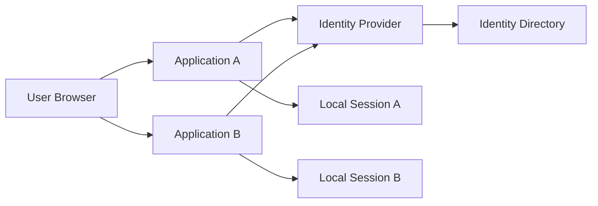
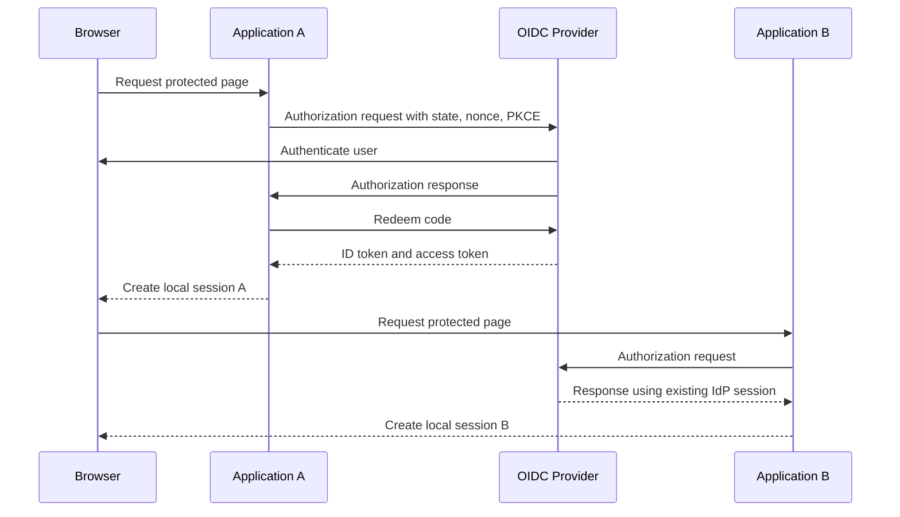
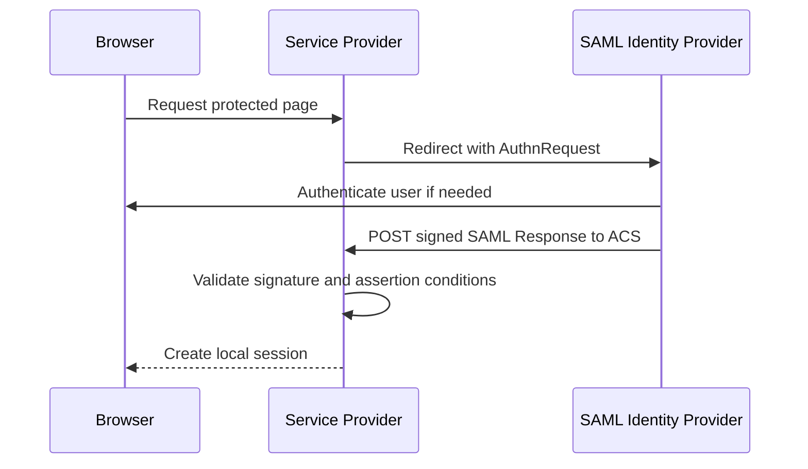

# Single Sign-On with OIDC and SAML

## Current status

SSO is documented and scheduled in LAB-016 through LAB-020, but it is not yet implemented in runnable code. The `oauth2-auth` module remains a scaffold. Treat the configurations on this page as target architecture, not proof of a working integration.

## What SSO means

Single Sign-On is an outcome: a user authenticates with a central Identity Provider (IdP), and multiple applications establish their own trusted local sessions without asking for credentials again. SSO is not itself a protocol.

Common protocols are:

- **OpenID Connect (OIDC):** Modern JSON/JWT identity layer built on OAuth 2.0. Usually preferred for new web and mobile systems.
- **SAML 2.0:** XML-based enterprise federation protocol commonly used with established workforce identity platforms.
- **Kerberos/SPNEGO:** Integrated authentication for managed enterprise networks; outside the first implementation track.

OAuth 2.0 alone delegates authorization and does not define user authentication. OIDC adds identity, authentication context, ID tokens, UserInfo, nonce, and session/logout conventions.

## SSO trust model


```mermaid
graph LR
    U[User Browser] --> A[Application A]
    U --> B[Application B]
    A --> I[Identity Provider]
    B --> I
    I --> D[Identity Directory]
    A --> SA[Local Session A]
    B --> SB[Local Session B]
```

Applications A and B do not normally share an application cookie. Each application validates an IdP response and creates its own session. When the user reaches Application B, the IdP's existing session allows it to issue a new response without prompting for credentials.

## OIDC SSO flow


```mermaid
sequenceDiagram
    participant U as Browser
    participant A as Application A
    participant I as OIDC Provider
    participant B as Application B
    U->>A: Request protected page
    A->>I: Authorization request with state, nonce, PKCE
    I->>U: Authenticate user
    I->>A: Authorization response
    A->>I: Redeem code
    I-->>A: ID token and access token
    A-->>U: Create local session A
    U->>B: Request protected page
    B->>I: Authorization request
    I-->>B: Response using existing IdP session
    B-->>U: Create local session B
```

Spring Security client configuration starts with:

```java
@Bean
SecurityFilterChain oidcSecurityFilterChain(HttpSecurity http) throws Exception {
    return http
        .authorizeHttpRequests(authorize -> authorize
            .requestMatchers("/", "/error").permitAll()
            .anyRequest().authenticated())
        .oauth2Login(Customizer.withDefaults())
        .build();
}
```

The runnable version must obtain provider and client settings from external configuration and must test state, nonce, redirect URI, PKCE, authority mapping, and logout behavior.

## SAML SSO flow


```mermaid
sequenceDiagram
    participant U as Browser
    participant S as Service Provider
    participant I as SAML Identity Provider
    U->>S: Request protected page
    S->>I: Redirect with AuthnRequest
    I->>U: Authenticate user if needed
    I->>S: POST signed SAML Response to ACS
    S->>S: Validate signature and assertion conditions
    S-->>U: Create local session
```

Spring Security relying-party configuration starts with:

```java
@Bean
SecurityFilterChain samlSecurityFilterChain(HttpSecurity http) throws Exception {
    return http
        .authorizeHttpRequests(authorize -> authorize
            .requestMatchers("/", "/error").permitAll()
            .anyRequest().authenticated())
        .saml2Login(Customizer.withDefaults())
        .saml2Logout(Customizer.withDefaults())
        .build();
}
```

A working integration must validate the response signature, issuer, destination, audience, recipient, time conditions, request correlation, and replay behavior. Attributes must be allow-listed before mapping to authorities.

## Sessions and logout

SSO does not imply one shared session or guaranteed Single Logout.

- **Local logout:** Ends one application's session only.
- **RP-initiated logout:** An OIDC application asks the provider to end or coordinate the provider session.
- **OIDC back-channel logout:** The provider notifies registered applications directly.
- **SAML Single Logout:** Coordinates logout through SAML messages but is operationally sensitive to partial failures.
- **Global IdP logout:** Ends the central IdP session; application sessions may remain unless coordinated.

Document which outcome each logout button provides. Never claim global logout when only a local cookie was removed.

## Protocol selection

| Question | OIDC | SAML 2.0 |
|---|---|---|
| New browser/mobile application | Preferred | Usually not preferred |
| Existing enterprise federation | Common | Very common |
| Message format | JSON/JWT | XML |
| API authorization | OAuth access tokens | Exchange for an API token rather than forwarding assertions |
| Metadata/discovery | OIDC discovery | SAML metadata |
| Primary artifact | Authorization response and ID token | SAML response/assertion |
| Key operations | JWK rotation | Metadata/certificate rollover |

Do not send an ID token or SAML assertion as a general-purpose microservice API credential. APIs should validate an audience-restricted access token or workload credential.

## Required security checks

### OIDC

- Exact redirect URI registration
- State, nonce, and PKCE validation
- Trusted issuer and JWK source
- Signature, algorithm, audience, and time validation
- Allow-listed claim-to-authority mapping
- Secure local session cookie and CSRF protection

### SAML

- Trusted metadata and signing certificates
- Signature and approved algorithm validation
- Issuer, destination, audience, and recipient checks
- `NotBefore` and `NotOnOrAfter` handling with bounded skew
- `InResponseTo` correlation and replay protection
- Allow-listed attribute-to-authority mapping

### Shared operational controls

- MFA and authentication-context requirements for sensitive access
- Session lifetime, idle timeout, reauthentication, and step-up policy
- Privacy-safe authentication and logout audit events
- IdP outage and certificate/key rotation procedures
- No tokens, assertions, authorization codes, or cookies in logs

## Threats to test

| Threat | Expected protection |
|---|---|
| Login CSRF or response injection | State and request correlation |
| Authorization-code interception | PKCE and exact redirect URI |
| Token/assertion replay | Nonce, one-time code, assertion correlation, replay cache |
| Forged identity | Signature and trusted issuer/certificate validation |
| Privilege escalation through claims | Allow-listed server-controlled mapping |
| Session theft | Secure, HttpOnly, SameSite cookies and session rotation |
| Incomplete logout | Explicit local/provider/global semantics |
| IdP compromise | Least privilege, short sessions, monitoring, and response plan |

## Labs and evidence

- **LAB-010:** Reproducible local Identity Provider
- **LAB-011:** Authorization Code with PKCE
- **LAB-012:** OIDC identity and authority mapping
- **LAB-014:** Refresh, revocation, and logout
- **LAB-015:** JWK rotation and multiple issuers
- **LAB-016:** Two-client OIDC SSO
- **LAB-017:** SAML relying party
- **LAB-018:** SAML attributes and authorization
- **LAB-019:** SAML assertion validation
- **LAB-020:** SAML logout and certificate rollover

See the [Lab Roadmap](../labs.md) for implementation, proof, attack cases, and completion criteria. SSO should move from Theory to Verified in the [Coverage Registry](../coverage.md) only after the two-client OIDC lab and its negative tests pass.
