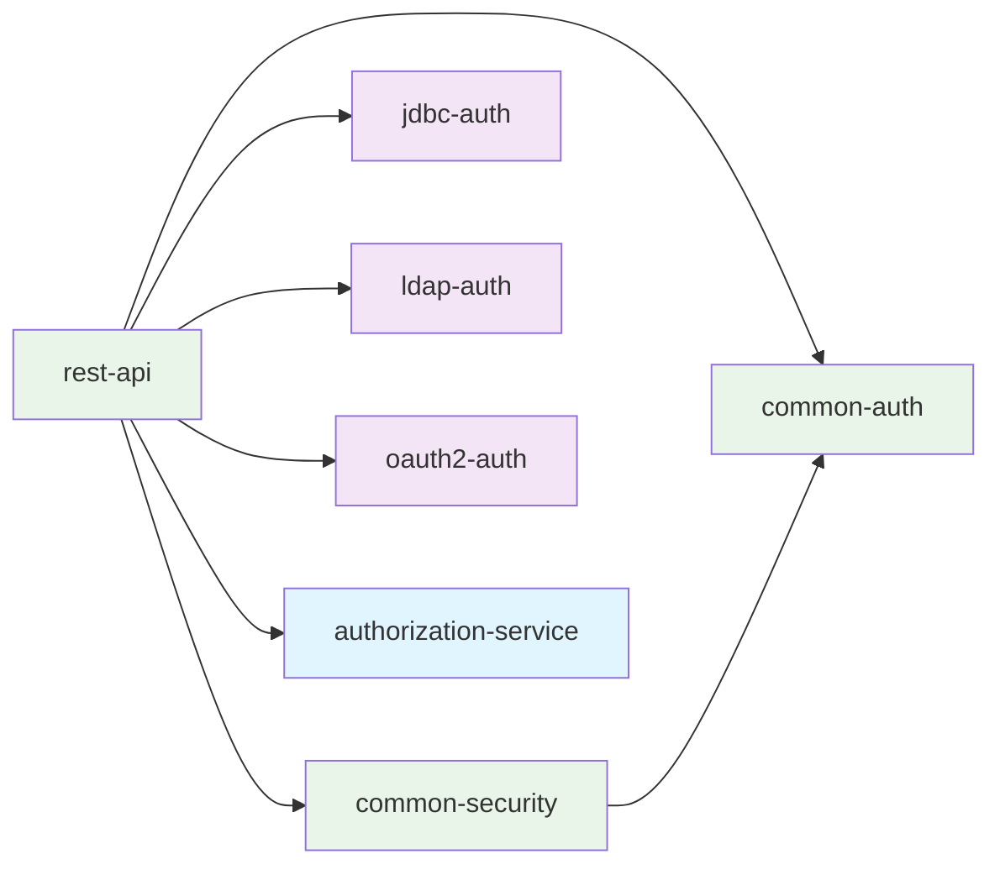
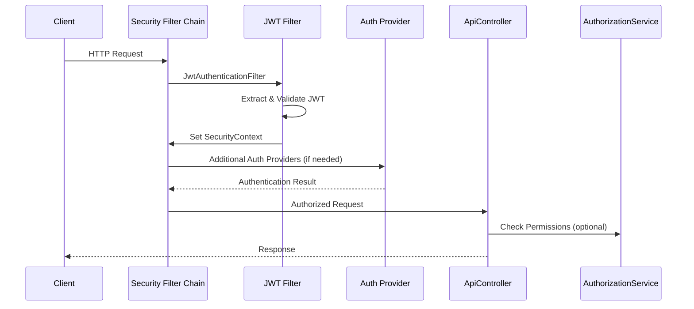

# Project Overview

The **Spring Security Reference Project** is a comprehensive educational resource designed to demonstrate modern Spring Security patterns and best practices. This project showcases multiple authentication methods, security configurations, and real-world implementation patterns.

## 🎯 Learning Objectives

After working through this project, you will understand:

- **Multiple Authentication Strategies**: How to implement and integrate different authentication methods
- **Security Filter Chains**: How Spring Security processes requests and applies security rules
- **JWT Token Management**: Stateless authentication with JSON Web Tokens
- **Role-Based Access Control**: Implementing fine-grained authorization
- **Integration Patterns**: Combining multiple authentication providers
- **Security Best Practices**: Production-ready security configurations

## 🏛️ Architecture Philosophy

This project follows a **modular layered architecture** with clear separation of concerns:

### Design Principles

1. **Modularity**: Each authentication method is isolated in its own module
2. **Educational Focus**: Comprehensive logging explains every security decision
3. **Real-world Patterns**: Configurations mirror production environments
4. **Testability**: Each module can be tested independently
5. **Extensibility**: Easy to add new authentication methods

### Module Dependencies


```mermaid
graph LR
    A[rest-api] --> B[common-security]
    A --> C[common-auth]
    A --> D[jdbc-auth]
    A --> E[ldap-auth] 
    A --> F[oauth2-auth]
    A --> G[authorization-service]
    
    B --> C
    
    classDef coreModule fill:#e1f5fe
    classDef authModule fill:#f3e5f5
    classDef serviceModule fill:#e8f5e8
    
    class A,B,C serviceModule
    class D,E,F authModule
    class G coreModule
```

## 🔒 Security Patterns Demonstrated

### 1. Authentication Methods

| Method | Module | Use Case | Educational Focus |
|--------|---------|----------|-------------------|
| **Custom/Session** | `common-auth` | Simple hardcoded users | `CustomAuthenticationProvider`, `AuthService` |
| **JWT** | `common-auth` | Stateless APIs | Token generation with `Keys.secretKeyFor()`, validation, claims |
| **JDBC** | `jdbc-auth` | Database-backed users | `JdbcUserDetailsManager`, BCrypt password encoding |
| **LDAP** | `ldap-auth` | Enterprise directories | Directory integration, attribute mapping |
| **OAuth2** | `oauth2-auth` | Social login, SSO | Modern identity protocols, token handling |

### 2. Security Configurations

- **Filter Chain Setup**: `MultiAuthSecurityConfig` with profile-based configuration
- **Method Security**: Annotation-based authorization
- **CORS Configuration**: Cross-origin request handling  
- **Session Management**: Stateful vs stateless strategies

### 3. Advanced Patterns

- **Multi-Provider Authentication**: Combining different auth methods via conditional `@Autowired`
- **Custom Authentication Providers**: Building tailored auth logic
- **Security Context Management**: Handling authenticated users via `SecurityContextHolder`
- **Exception Handling**: Graceful security error responses

## 📊 Request Flow

Understanding how requests flow through the security system:


```mermaid
sequenceDiagram
    participant C as Client
    participant F as Security Filter Chain
    participant J as JWT Filter
    participant A as Auth Provider
    participant S as ApiController
    participant D as AuthorizationService

    C->>F: HTTP Request
    F->>J: JwtAuthenticationFilter
    J->>J: Extract & Validate JWT
    J->>F: Set SecurityContext
    F->>A: Additional Auth Providers (if needed)
    A-->>F: Authentication Result
    F->>S: Authorized Request
    S->>D: Check Permissions (optional)
    S-->>C: Response
```

## 🎓 Educational Features

### Comprehensive Logging

Every security operation includes educational logging:

```java
logger.info("🔐 [JDBC-AUTH] Creating BCrypt password encoder for database users");
logger.debug("📚 [LEARNING] BCrypt adds salt and hashing for secure password storage");
logger.debug("🔄 [LEARNING] Authentication flow: request → provider → userDetailsService → passwordEncoder");
```

### Learning Annotations

Code comments explain Spring Security concepts:

```java
/**
 * Utility class for JWT token creation and validation.
 *
 * Uses cryptographically secure keys for HS512 algorithm.
 * The signing key is generated using Keys.secretKeyFor() which ensures
 * the key is at least 512 bits (64 bytes) as required by HS512.
 */
@Component
public class JwtTokenUtil {
    // ...
}
```

### Testing Examples

Complete HTTP test files demonstrate:

- Authentication flows for each method
- Role-based endpoint access
- Error handling scenarios
- Token lifecycle management

## 🚀 Getting Started

Ready to dive in? Follow these paths based on your learning goals:

### For Beginners
1. **[Quick Setup](quick-setup.md)** - Get the project running
2. **[Project Structure](project-structure.md)** - Understand the codebase
3. **[JDBC Authentication](../authentication/jdbc-auth.md)** - Start with database auth

### For Intermediate Users
1. **[Security Configuration](../security/index.md)** - Understand security setup
2. **[JWT Tokens](../authentication/jwt-tokens.md)** - Learn stateless authentication
3. **[API Testing](../examples/testing-api.md)** - Practice with endpoints

### For Advanced Users
1. **[Custom Providers](../examples/custom-providers.md)** - Build custom auth logic
2. **[Advanced Patterns](../examples/advanced-patterns.md)** - Complex security scenarios
3. **[Production Setup](../deployment/production.md)** - Deploy securely

## 📦 Module Summary

| Module | Description |
|--------|-------------|
| `rest-api` | Main Spring Boot application with REST endpoints |
| `common-auth` | JWT utilities, authentication filter, custom provider |
| `common-security` | `MultiAuthSecurityConfig`, gRPC/WebSocket interceptors |
| `authorization-service` | Role and permission management |
| `jdbc-auth` | H2 database authentication with BCrypt |
| `ldap-auth` | Embedded LDAP server authentication |
| `oauth2-auth` | OAuth2/OIDC social login (GitHub, Google) |
| `graphql-service` | GraphQL API scaffold |
| `websocket-service` | WebSocket messaging with STOMP |

See [Project Structure](project-structure.md) for detailed module information.
