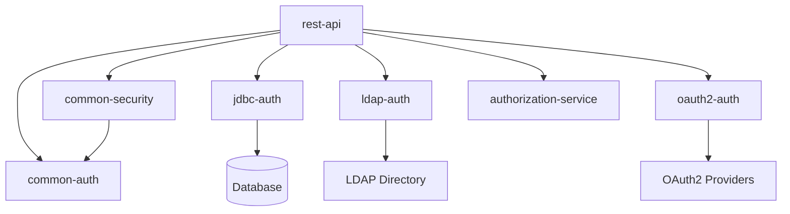

# Spring Security Reference Project

Welcome to the **Spring Security Reference Project** - a comprehensive educational resource demonstrating advanced Spring Security authentication and authorization patterns.


[View License](https://github.com/nitinkc/spring-security-reference/blob/main/LICENSE)

## 🎯 Project Overview

This project serves as a **living reference** for Spring Security implementations, featuring:

- **Multiple Authentication Methods**: JDBC, LDAP, OAuth2/OIDC
- **Comprehensive Logging**: Educational tracing of all security flows
- **Real-world Patterns**: Production-ready security configurations  
- **Testing Examples**: Complete API testing suite
- **Modular Architecture**: Independent, reusable authentication modules

## 🏗️ Architecture



## 🚀 Quick Start

### Prerequisites
- Java 17+
- Maven 3.6+
- Your favorite IDE

### Run the Application
```bash
git clone <repository-url>
cd spring-security-reference
mvn clean install
mvn spring-boot:run -pl rest-api
```

### Test Authentication
```bash
# Test public endpoint
curl http://localhost:8080/api/public/hello

# Get JWT token
curl -X POST http://localhost:8080/api/auth/login \
  -d "username=admin&password=password"

# Use JWT token
curl -H "Authorization: Bearer <token>" \
  http://localhost:8080/api/admin/secure
```

## 📚 Learning Path

1. **[Getting Started](getting-started/overview.md)** - Understand the project structure
2. **[Authentication Methods](authentication/index.md)** - Explore different auth strategies
3. **[Security Configuration](security/index.md)** - Learn security setup patterns
4. **[API Reference](api/index.md)** - Test endpoints and flows
5. **[Examples & Tutorials](examples/index.md)** - Practice with real scenarios

## 🔧 Modules

| Module | Description | Purpose |
|--------|-------------|---------|
| **rest-api** | REST endpoints and main application | Entry point with secured endpoints |
| **common-auth** | Shared authentication utilities | JWT, session, and base auth logic |
| **common-security** | Security configuration | Filters, interceptors, and config |
| **jdbc-auth** | Database authentication | JDBC-based user authentication |
| **ldap-auth** | Directory authentication | LDAP/AD integration patterns |
| **oauth2-auth** | OAuth2/OIDC authentication | Social login and identity providers |
| **authorization-service** | Role & permission management | Authorization logic and rules |

## 🔍 Key Features

### Educational Logging
Every security operation is logged with educational annotations:

```java
logger.info("🔐 [JDBC-AUTH] Creating BCrypt password encoder for database users");
logger.debug("📚 [LEARNING] BCrypt adds salt and hashing for secure password storage");
```

### Multiple Authentication Flows
- **Session-based**: Traditional form login with sessions
- **JWT-based**: Stateless token authentication  
- **OAuth2/OIDC**: Social login integration
- **Database**: JDBC user store authentication
- **Directory**: LDAP/Active Directory integration

### Comprehensive Testing
- HTTP test files for all endpoints
- Authentication flow testing
- Role-based access control validation

## 🤝 Contributing

This is an educational project designed to demonstrate Spring Security patterns. Contributions that enhance the learning experience are welcome!

## 📄 License

This project is licensed under the MIT License - see the [LICENSE](LICENSE) file for details.

## 🆘 Support

- 📖 **Documentation**: Browse this site for comprehensive guides
- 🐛 **Issues**: Report bugs or request features on GitHub
- 💬 **Discussions**: Join community discussions for help

---

**Happy Learning!** 🎓

> This project is designed for educational purposes to help developers understand Spring Security concepts through practical, well-documented examples.

# MkDocs Documentation Setup

This directory contains the MkDocs configuration and documentation source files for the Spring Security Reference Project.

## 🚀 Quick Start

### 1. Install MkDocs

```bash
# Install Python dependencies
pip install -r requirements.txt

# Or install individually
pip install mkdocs-material
```

### 2. Serve Documentation Locally

```bash
# Start development server
python -m mkdocs serve

# Open browser to http://localhost:8000
```

### 3. Build Static Site

```bash
# Build static site
python -m mkdocs build

# Output will be in site/ directory
```

## 🎨 Customization

### Theme Configuration

The documentation uses Material for MkDocs with custom colors and features:

- **Primary Color**: Green (Spring theme)
- **Accent Color**: Teal
- **Dark/Light Mode**: Auto-switching based on system preference
- **Features**: Navigation tabs, search, code copying, syntax highlighting

### Adding Content

1. **Create new markdown files** in appropriate directories
2. **Update navigation** in `mkdocs.yml`
3. **Use Material extensions** for enhanced formatting
4. **Include diagrams** with Mermaid syntax

### Markdown Extensions

Available extensions include:

- **Code highlighting** with syntax highlighting
- **Admonitions** for notes, warnings, tips
- **Mermaid diagrams** for flowcharts and sequences
- **Tabbed content** for organized information
- **Task lists** with checkboxes
- **Mathematical expressions** with MathJax

## 🚀 Deployment Options

### GitHub Pages

1. **Create `.github/workflows/docs.yml`**:

```yaml
name: Deploy Documentation
on:
  push:
    branches: [ main ]
jobs:
  deploy:
    runs-on: ubuntu-latest
    steps:
    - uses: actions/checkout@v3
    - uses: actions/setup-python@v4
      with:
        python-version: 3.x
    - run: pip install -r requirements.txt
    - run: python -m mkdocs gh-deploy --force
```

2. **Enable GitHub Pages** in repository settings
3. **Set source** to `gh-pages` branch


## 🔧 Development

### Live Reloading

The development server automatically reloads when files change:

```bash
python -m mkdocs serve --dev-addr=0.0.0.0:8000
```

### Validation

Check for broken links and validate structure:

```bash
python -m mkdocs build --strict
```

## 💡 Tips

- **Use emoji sparingly** but consistently for visual cues
- **Include diagrams** for complex authentication flows
- **Provide complete examples** with expected outputs
- **Cross-link sections** to improve navigation
- **Keep content up-to-date** with code changes

### The Magic of mkdocs gh-deploy: 

First, `mkdocs` builds your static website from your Markdown files in the docs directory, creating all the necessary HTML, CSS, and JavaScript files.

Second, it automatically commits and pushes this newly built static site to a branch named `gh-pages` in your repository. The `--force` flag ensures it overwrites the previous content.
In summary:

The `gh-pages` branch is a special branch that only contains the compiled, ready-to-view website. Your source code (the Markdown files) lives in the main branch. The GitHub Action acts as a bridge, automatically building the site from main and publishing the result to gh-pages whenever you update main