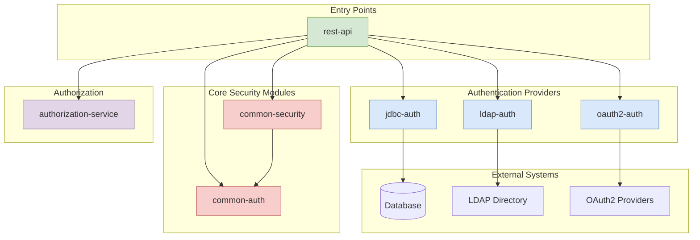
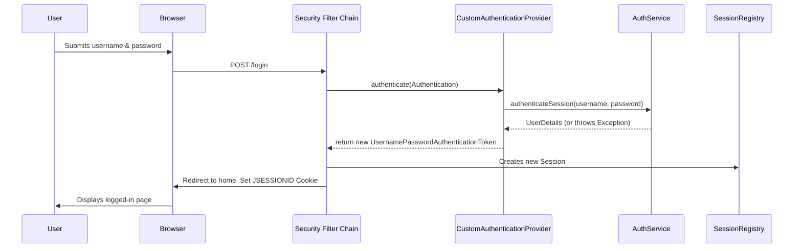
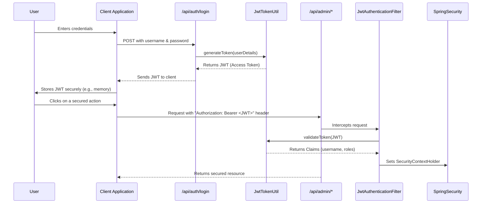
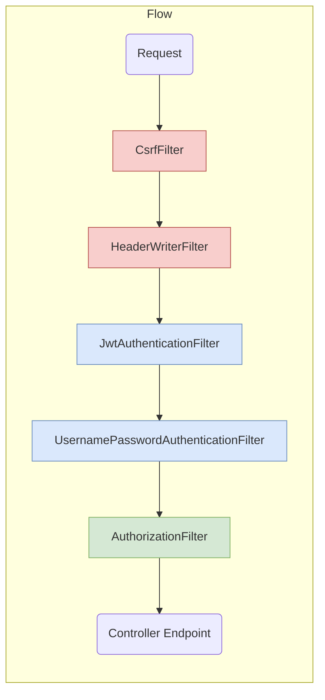
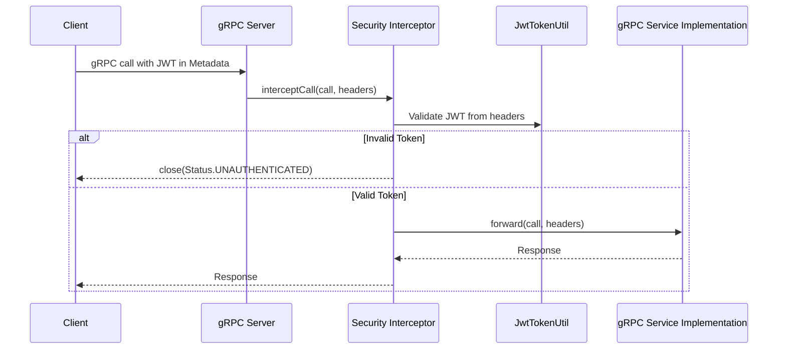
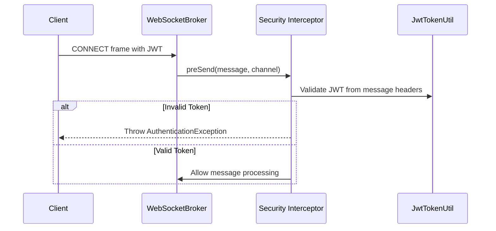

# Project Architecture and Flow Diagrams

This page provides a detailed visual reference for the architecture, authentication flows, and security mechanisms used in the Spring Security Reference Project.

## 1. Overall Project Architecture

This diagram illustrates the modular architecture of the project, showing how different services and components are interconnected. The `rest-api` module is the central entry point, consuming functionality from various authentication and security modules.



### Key Takeaways:
- **Modular Design**: Each authentication method (`jdbc-auth`, `ldap-auth`, `oauth2-auth`) is a separate module.
- **Shared Logic**: `common-auth` and `common-security` provide reusable security configurations and utilities.
- **Centralized API**: The `rest-api` module integrates all security features and exposes the endpoints.

---

## 2. Authentication Flow - Session-Based Login

This sequence diagram shows the step-by-step process for a traditional, session-based user login.



### Flow Explanation:
1.  The user submits their credentials via a login form.
2.  Spring Security's filter chain intercepts the request.
3.  The `CustomAuthenticationProvider` is invoked.
4.  It delegates the core authentication logic to the `AuthService`.
5.  If successful, an `Authentication` object is returned and stored in the `SecurityContext`.
6.  A `JSESSIONID` cookie is created, and the user is logged in.

---

## 3. Authentication Flow - JWT-Based Login

This diagram details the process of obtaining and using a JSON Web Token (JWT) for stateless authentication.



### Flow Explanation:
1.  The user logs in at a dedicated endpoint (`/api/auth/login`).
2.  The server validates credentials and uses `JwtTokenUtil` to generate a token.
3.  The token is sent back to the client.
4.  For subsequent requests to secured endpoints, the client sends the JWT in the `Authorization` header.
5.  The `JwtAuthenticationFilter` intercepts the request, validates the token, and sets the security context, allowing access.

---

## 4. Spring Security Filter Chain

This diagram visualizes the key filters in the Spring Security chain and their order of execution.



### Filter Descriptions:
- **`CsrfFilter`**: Protects against Cross-Site Request Forgery attacks.
- **`HeaderWriterFilter`**: Adds security-related headers to the response (e.g., `X-Content-Type-Options`).
- **`JwtAuthenticationFilter`**: (Custom) Validates JWTs from the `Authorization` header.
- **`UsernamePasswordAuthenticationFilter`**: Handles form-based login submissions.
- **`AuthorizationFilter`**: Enforces access control rules on endpoints based on user roles/permissions.

---

## 5. Authorization Logic

This flowchart explains how the system determines if a user has permission to access a secured resource.

```mermaid
graph TD
    A[User requests secured endpoint] --> B{Is user authenticated?};
    B -- No --> C[Access Denied (401 Unauthorized)];
    B -- Yes --> D{Endpoint requires specific role?};
    D -- No --> E[Access Granted];
    D -- Yes --> F{Does user have the required role?};
    F -- No --> G[Access Denied (403 Forbidden)];
    F -- Yes --> H{Endpoint requires specific permission?};
    H -- No --> E;
    H -- Yes --> I{Does user's role have the permission?};
    I -- No --> G;
    I -- Yes --> E;

    style C fill:#F8CECC,stroke:#B85450
    style G fill:#F8CECC,stroke:#B85450
    style E fill:#D5E8D4,stroke:#82B366
```

### Logic Explanation:
1.  The system first checks if the user is authenticated at all.
2.  It then checks if the requested endpoint is protected by a specific role (e.g., `ROLE_ADMIN`).
3.  If a role is required, it verifies the user has that role.
4.  Finally, for more granular control, it can check for specific permissions associated with the user's role (e.g., `CAN_DELETE_USER`).
5.  Access is only granted if all checks pass.

---

## 6. gRPC and WebSocket Security Interception

These diagrams show how security is applied to non-HTTP protocols like gRPC and WebSockets using interceptors.

### gRPC Security Interceptor



### WebSocket Security Interceptor



### Interceptor Explanation:
- **gRPC**: An interceptor extracts the JWT from the call's `Metadata` (headers), validates it, and either closes the call with an `UNAUTHENTICATED` status or forwards it to the service implementation.
- **WebSocket**: A `ChannelInterceptor` inspects messages on the channel. The `preSend` method is used to validate a JWT sent during the `CONNECT` phase, preventing unauthorized clients from subscribing or sending messages.
