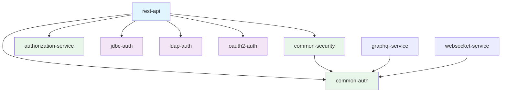

# Module Documentation

Comprehensive reference for all modules in the Spring Security Reference project.

## 📦 **Module Overview**

| Module | Purpose | Key Classes |
|--------|---------|-------------|
| **rest-api** | Main application, REST endpoints | `RestApiApplication`, `ApiController` |
| **common-auth** | Core authentication logic | `JwtTokenUtil`, `JwtAuthenticationFilter`, `AuthService` |
| **common-security** | Security configuration | `MultiAuthSecurityConfig`, `GrpcSecurityInterceptor` |
| **authorization-service** | Role/permission management | `AuthorizationService` |
| **jdbc-auth** | Database authentication | `JdbcAuthConfig`, `JdbcDataInitializer` |
| **ldap-auth** | LDAP/AD authentication | `LdapAuthConfig`, `PersonContextMapper` |
| **oauth2-auth** | Social login integration | `OAuth2AuthConfig`, `OAuth2AuthenticationSuccessHandler` |
| **graphql-service** | GraphQL API (scaffold) | `GraphQLController`, `GraphQLSecurityInterceptor` |
| **websocket-service** | WebSocket messaging | `WebSocketController`, `WebSocketConfig` |

---

## 🔐 **common-auth**

Core authentication components used across the project.

### Classes

| Class | Purpose |
|-------|---------|
| `JwtTokenUtil` | JWT token generation and validation using HS512 algorithm |
| `JwtAuthenticationFilter` | Extracts and validates JWT from `Authorization` header |
| `AuthService` | Session-based authentication logic |
| `CustomAuthenticationProvider` | Spring Security `AuthenticationProvider` implementation |
| `TwoFactorAuthService` | 2FA/TOTP integration hooks |

### Key Features
- Secure key generation with `Keys.secretKeyFor(SignatureAlgorithm.HS512)`
- 24-hour token expiration
- Role claim embedded in JWT payload

---

## 🛡️ **common-security**

Security configuration and cross-cutting concerns.

### Classes

| Class | Purpose |
|-------|---------|
| `MultiAuthSecurityConfig` | Main security config with profile-based filter chains |
| `SecurityConfig` | Legacy config (disabled via `@Profile`) |
| `GrpcSecurityInterceptor` | JWT validation for gRPC calls |
| `WebSocketSecurityInterceptor` | Security for WebSocket messages |

### Supported Profiles
- **Default**: All authentication methods enabled
- **`oauth2-only`**: OAuth2/social login only
- **`jdbc-only`**: Database authentication only
- **`ldap-only`**: LDAP authentication only

---

## 👥 **authorization-service**

Role and permission management.

### Classes

| Class | Purpose |
|-------|---------|
| `AuthorizationService` | User role lookup and permission checking |

### Methods
```java
String getUserRole(String username)      // Returns ROLE_ADMIN, ROLE_USER, or ROLE_GUEST
boolean hasPermission(String username, String permission)  // Check specific permissions
```

### Default Users
| Username | Role |
|----------|------|
| `admin` | `ROLE_ADMIN` |
| `user` | `ROLE_USER` |
| Others | `ROLE_GUEST` |

---

## 🗄️ **jdbc-auth**

Database-backed authentication with H2 and BCrypt.

### Classes

| Class | Purpose |
|-------|---------|
| `JdbcAuthConfig` | Configures `JdbcUserDetailsManager` and `BCryptPasswordEncoder` |
| `JdbcDataInitializer` | Creates demo users on startup |

### Demo Users
| Username | Password | Role |
|----------|----------|------|
| `jdbcadmin` | `password` | `ROLE_ADMIN` |
| `jdbcuser` | `password` | `ROLE_USER` |

### Active Profiles
- `default`
- `jdbc-only`

---

## 🏢 **ldap-auth**

LDAP/Active Directory authentication.

### Classes

| Class | Purpose |
|-------|---------|
| `LdapAuthConfig` | Configures embedded LDAP server and authentication |
| `PersonContextMapper` | Maps LDAP attributes to Spring Security user details |

### Demo Users
| Username | Password | Role |
|----------|----------|------|
| `ldapadmin` | `password` | `ROLE_ADMIN` |
| `ldapuser` | `password` | `ROLE_USER` |

---

## 🌐 **oauth2-auth**

OAuth2/OpenID Connect integration for social login.

### Classes

| Class | Purpose |
|-------|---------|
| `OAuth2AuthConfig` | OAuth2 client configuration |
| `OAuth2AuthenticationSuccessHandler` | Post-login JWT token generation |

### Supported Providers
- GitHub
- Google
- Custom OAuth2 providers

!!! note "Current Status"
    OAuth2 integration is currently commented out in `MultiAuthSecurityConfig`. 
    Uncomment to enable social login features.

---

## 🌐 **rest-api**

Main application entry point and REST controllers.

### Classes

| Class | Purpose |
|-------|---------|
| `RestApiApplication` | Spring Boot main class |
| `ApiController` | REST endpoints for all authentication demos |

### Endpoints
See [REST Endpoints](../api/rest-endpoints.md) for complete API reference.

---

## 📊 **graphql-service**

GraphQL API scaffold for future development.

### Classes

| Class | Purpose |
|-------|---------|
| `GraphQLController` | Basic GraphQL query endpoint |
| `GraphQLSecurityInterceptor` | Placeholder for GraphQL security |

### Current Implementation
```java
@QueryMapping
public String hello() {
    return "Hello from GraphQL!";
}
```

---

## 📡 **websocket-service**

WebSocket messaging with STOMP protocol.

### Classes

| Class | Purpose |
|-------|---------|
| `WebSocketConfig` | STOMP endpoint and message broker configuration |
| `WebSocketController` | Message handling endpoints |
| `WebSocketSecurityInterceptor` | Channel-level security |

### Endpoints
| Endpoint | Purpose |
|----------|---------|
| `/hello` | Message mapping for greetings |
| `/topic/greetings` | Broadcast destination |

---

## 🔗 **Module Dependencies**



## 🚀 **Getting Started**

1. **Build all modules**: `mvn clean install -DskipTests`
2. **Run the application**: `mvn spring-boot:run -pl rest-api`
3. **Test endpoints**: See [API Testing Guide](../examples/testing-api.md)
