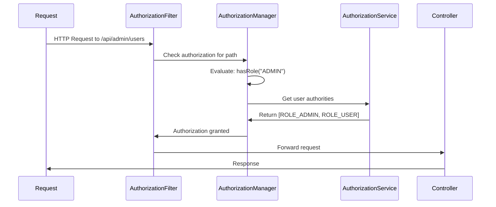

# Authorization & Access Control

Authorization is the process of determining what an authenticated user is allowed to do. This guide covers the comprehensive authorization patterns implemented in our Spring Security reference project.

## 🎯 **Authorization Architecture**

### **Role-Based Access Control (RBAC)**

```mermaid
graph TD
    A[Authenticated User] --> B{Role Check}
    B -->|ROLE_ADMIN| C[Admin Access]
    B -->|ROLE_USER| D[User Access]  
    B -->|No Role| E[Access Denied]
    
    C --> F[/api/admin/**]
    C --> G[/api/user/**]
    C --> H[All Endpoints]
    
    D --> I[/api/user/**]
    D --> J[Public Endpoints]
    
    E --> K[403 Forbidden]
```

### **Authorization Layers**

| Layer | Implementation | Purpose |
|-------|----------------|---------|
| **URL-Based** | `authorizeHttpRequests()` | Path-level access control |
| **Method-Based** | `@PreAuthorize`, `@Secured` | Fine-grained method security |
| **Business Logic** | `AuthorizationService` | Custom authorization rules |

## 🛡️ **URL-Based Authorization**

### **Authorization Rules Configuration**

```java
@Bean
public SecurityFilterChain defaultFilterChain(HttpSecurity http) throws Exception {
    return http
        .authorizeHttpRequests(authz -> authz
            // Public endpoints - no authentication required
            .requestMatchers("/api/public/**", "/api/auth/**").permitAll()
            .requestMatchers("/actuator/health").permitAll()
            
            // OAuth2 endpoints  
            .requestMatchers("/oauth2/**", "/login/oauth2/**").permitAll()
            
            // Admin-only endpoints
            .requestMatchers("/api/admin/**").hasRole("ADMIN")
            
            // User endpoints - both USER and ADMIN roles allowed
            .requestMatchers("/api/user/**").hasAnyRole("USER", "ADMIN")
            
            // Authentication method specific endpoints
            .requestMatchers("/api/jdbc/**").hasAnyRole("USER", "ADMIN")
            .requestMatchers("/api/ldap/**").hasAnyRole("USER", "ADMIN")
            
            // Everything else requires authentication
            .anyRequest().authenticated()
        )
        .build();
}
```

### **Authorization Rule Evaluation**



## 🔐 **Method-Level Authorization**

### **@PreAuthorize Examples**

```java
@RestController
public class AdminController {

    @PreAuthorize("hasRole('ADMIN')")
    @GetMapping("/api/admin/users")
    public List<User> getAllUsers() {
        return userService.findAll();
    }

    @PreAuthorize("hasRole('ADMIN') or #userId == authentication.name")
    @GetMapping("/api/admin/users/{userId}")
    public User getUser(@PathVariable String userId) {
        // Admin can access any user, regular users only themselves
        return userService.findById(userId);
    }

    @PreAuthorize("hasAuthority('USER_WRITE') and hasRole('ADMIN')")
    @PostMapping("/api/admin/users")
    public User createUser(@RequestBody User user) {
        return userService.save(user);
    }
}
```

### **@Secured Examples**

```java
@RestController
public class UserController {

    @Secured("ROLE_USER")
    @GetMapping("/api/user/profile")
    public UserProfile getProfile(Authentication auth) {
        return userService.getProfile(auth.getName());
    }

    @Secured({"ROLE_USER", "ROLE_ADMIN"})  
    @PutMapping("/api/user/profile")
    public UserProfile updateProfile(@RequestBody UserProfile profile) {
        return userService.updateProfile(profile);
    }
}
```

### **Method Security Configuration**

```java
@Configuration
@EnableGlobalMethodSecurity(
    prePostEnabled = true,    // Enable @PreAuthorize/@PostAuthorize
    securedEnabled = true,    // Enable @Secured
    jsr250Enabled = true      // Enable @RolesAllowed
)
public class MethodSecurityConfig {
    // Method-level security enabled
}
```

## 🎯 **Custom Authorization Service**

### **AuthorizationService Implementation**

```java
@Service
public class AuthorizationService {
    
    private final UserRepository userRepository;
    private final RoleRepository roleRepository;
    
    /**
     * Get user's role from database
     */
    public String getUserRole(String username) {
        return userRepository.findByUsername(username)
            .map(User::getRole)
            .orElse("ROLE_USER");
    }
    
    /**
     * Check if user has specific permission
     */
    public boolean hasPermission(String username, String permission) {
        User user = userRepository.findByUsername(username).orElse(null);
        if (user == null) return false;
        
        return user.getPermissions().contains(permission);
    }
    
    /**
     * Get all user authorities (roles + permissions)
     */
    public Set<String> getUserAuthorities(String username) {
        User user = userRepository.findByUsername(username).orElse(null);
        if (user == null) return Set.of();
        
        Set<String> authorities = new HashSet<>();
        authorities.add(user.getRole());
        authorities.addAll(user.getPermissions());
        return authorities;
    }
    
    /**
     * Business logic authorization
     */
    public boolean canAccessResource(String username, String resourceId, String action) {
        // Custom business logic
        User user = userRepository.findByUsername(username).orElse(null);
        if (user == null) return false;
        
        // Admin can access everything
        if ("ROLE_ADMIN".equals(user.getRole())) {
            return true;
        }
        
        // Resource owner can access their own resources
        Resource resource = resourceRepository.findById(resourceId).orElse(null);
        if (resource != null && username.equals(resource.getOwnerId())) {
            return true;
        }
        
        // Check specific permissions
        String requiredPermission = resourceId + ":" + action;
        return user.getPermissions().contains(requiredPermission);
    }
}
```

### **Using AuthorizationService in Controllers**

```java
@RestController
public class ResourceController {
    
    @Autowired
    private AuthorizationService authorizationService;
    
    @GetMapping("/api/resources/{resourceId}")
    public ResponseEntity<Resource> getResource(
            @PathVariable String resourceId,
            Authentication auth) {
            
        // Custom authorization check
        if (!authorizationService.canAccessResource(auth.getName(), resourceId, "READ")) {
            return ResponseEntity.status(HttpStatus.FORBIDDEN).build();
        }
        
        Resource resource = resourceService.findById(resourceId);
        return ResponseEntity.ok(resource);
    }
}
```

## 🔄 **Role Hierarchy**

### **Role Hierarchy Configuration**

```java
@Bean
public RoleHierarchy roleHierarchy() {
    RoleHierarchyImpl roleHierarchy = new RoleHierarchyImpl();
    roleHierarchy.setHierarchy("ROLE_ADMIN > ROLE_USER > ROLE_GUEST");
    return roleHierarchy;
}

@Bean  
public DefaultWebSecurityExpressionHandler expressionHandler() {
    DefaultWebSecurityExpressionHandler expressionHandler = 
        new DefaultWebSecurityExpressionHandler();
    expressionHandler.setRoleHierarchy(roleHierarchy());
    return expressionHandler;
}
```

### **Role Hierarchy Benefits**

```java
// With hierarchy: ROLE_ADMIN > ROLE_USER
@PreAuthorize("hasRole('USER')")  // ADMIN users also have access
public String userEndpoint() {
    return "User content";
}

// Without hierarchy
@PreAuthorize("hasRole('USER') or hasRole('ADMIN')")  // Must be explicit
public String userEndpoint() {  
    return "User content";
}
```

## 🎭 **Authorization by Authentication Method**

### **JWT Token Authorization**

```java
public class JwtAuthenticationFilter extends OncePerRequestFilter {
    
    @Override
    protected void doFilterInternal(HttpServletRequest request,
                                    HttpServletResponse response,
                                    FilterChain chain) throws ServletException, IOException {
        // Extract JWT and validate
        if (jwtToken != null) {
            Claims claims = jwtTokenUtil.getClaimsFromToken(jwtToken);
            String username = claims.getSubject();
            String role = claims.get("role", String.class);
            
            // Create authorities from JWT claims
            List<SimpleGrantedAuthority> authorities = List.of(
                new SimpleGrantedAuthority(role)
            );
            
            // Set authentication with authorities
            UsernamePasswordAuthenticationToken authToken =
                    new UsernamePasswordAuthenticationToken(username, null, authorities);
            SecurityContextHolder.getContext().setAuthentication(authToken);
        }
        
        chain.doFilter(request, response);
    }
}
```

### **Database Authorization**

```java
@Configuration
public class JdbcAuthConfig {
    
    @Bean
    public UserDetailsService userDetailsService() {
        JdbcUserDetailsManager manager = new JdbcUserDetailsManager(dataSource);
        
        // Custom queries to load user authorities
        manager.setUsersByUsernameQuery(
            "SELECT username, password, enabled FROM users WHERE username = ?");
        manager.setAuthoritiesByUsernameQuery(
            "SELECT username, authority FROM authorities WHERE username = ?");
            
        return manager;
    }
}
```

### **LDAP Authorization**

```java
@Configuration  
public class LdapAuthConfig {
    
    @Bean
    public LdapAuthoritiesPopulator ldapAuthoritiesPopulator() {
        DefaultLdapAuthoritiesPopulator populator = 
            new DefaultLdapAuthoritiesPopulator(ldapContextSource(), "ou=groups");
        
        // Map LDAP groups to Spring Security authorities
        populator.setGroupRoleAttribute("cn");
        populator.setGroupSearchFilter("member={0}");
        populator.setRolePrefix("ROLE_");
        populator.setConvertToUpperCase(true);
        
        return populator;
    }
}
```

## 🚫 **Access Denied Handling**

### **Custom Access Denied Handler**

```java
@Component
public class CustomAccessDeniedHandler implements AccessDeniedHandler {
    
    @Override
    public void handle(HttpServletRequest request,
                       HttpServletResponse response,
                       AccessDeniedException accessDeniedException) throws IOException {
        
        // Log security violation
        logger.warn("Access denied for user {} to {}", 
            request.getRemoteUser(), request.getRequestURI());
        
        // Return JSON error response for API calls
        if (request.getRequestURI().startsWith("/api/")) {
            response.setStatus(HttpServletResponse.SC_FORBIDDEN);
            response.setContentType("application/json");
            
            String jsonResponse = """
                {
                    "error": "Access Denied",
                    "message": "You don't have permission to access this resource",
                    "timestamp": "%s",
                    "path": "%s"
                }
                """.formatted(Instant.now().toString(), request.getRequestURI());
                
            response.getWriter().write(jsonResponse);
        } else {
            // Redirect to access denied page for web requests
            response.sendRedirect("/access-denied");
        }
    }
}
```

### **Configure Access Denied Handler**

```java
@Bean
public SecurityFilterChain filterChain(HttpSecurity http) throws Exception {
    return http
        .exceptionHandling(ex -> ex
            .accessDeniedHandler(customAccessDeniedHandler)
        )
        .build();
}
```

## 📊 **Authorization Testing**

### **Testing Role-Based Access**

```java
@Test
@WithMockUser(roles = "ADMIN")
void adminCanAccessAdminEndpoints() throws Exception {
    mockMvc.perform(get("/api/admin/users"))
        .andExpect(status().isOk());
}

@Test
@WithMockUser(roles = "USER")  
void userCannotAccessAdminEndpoints() throws Exception {
    mockMvc.perform(get("/api/admin/users"))
        .andExpect(status().isForbidden());
}

@Test
@WithMockUser(username = "john", roles = "USER")
void userCanAccessOwnProfile() throws Exception {
    mockMvc.perform(get("/api/user/profile"))
        .andExpect(status().isOk());
}
```

### **Testing Method Security**

```java
@Test
void testMethodSecurityWithPreAuthorize() {
    // Arrange
    SecurityContextHolder.getContext().setAuthentication(
        new TestingAuthenticationToken("admin", null, "ROLE_ADMIN"));
    
    // Act & Assert
    assertDoesNotThrow(() -> adminService.deleteUser("user123"));
}

@Test  
void testMethodSecurityAccessDenied() {
    // Arrange
    SecurityContextHolder.getContext().setAuthentication(
        new TestingAuthenticationToken("user", null, "ROLE_USER"));
    
    // Act & Assert
    assertThrows(AccessDeniedException.class, 
        () -> adminService.deleteUser("user123"));
}
```

## 🎓 **Authorization Best Practices**

### ✅ **Do's**

1. **Use role hierarchy** for cleaner authorization rules
2. **Implement business logic authorization** for complex scenarios  
3. **Test authorization thoroughly** with different user roles
4. **Log access violations** for security monitoring
5. **Use method-level security** for fine-grained control

### ❌ **Don'ts**

1. **Don't hardcode roles** in business logic - use configuration
2. **Don't bypass authorization** in internal service calls  
3. **Don't expose sensitive data** in error messages
4. **Don't rely only on frontend** authorization - always secure the backend
5. **Don't forget to secure actuator endpoints** in production

### 🛡️ **Security Considerations**

- **Principle of Least Privilege**: Users get minimum necessary permissions
- **Defense in Depth**: Multiple authorization layers (URL + method + business logic)
- **Fail Secure**: Default to denying access when in doubt
- **Audit Trail**: Log all authorization decisions for compliance

## 🚀 **Next Steps**

- **[Authentication Methods →](../authentication/index.md)** - How users get authenticated
- **[API Security →](../api/index.md)** - Securing REST endpoints  
- **[Testing Authorization →](../examples/testing-auth.md)** - Authorization testing patterns
- **[Production Deployment →](../deployment/production.md)** - Production security considerations

---

**🎯 Authorization determines what authenticated users can do. The combination of URL-based, method-level, and custom business logic authorization provides comprehensive access control for enterprise applications.**