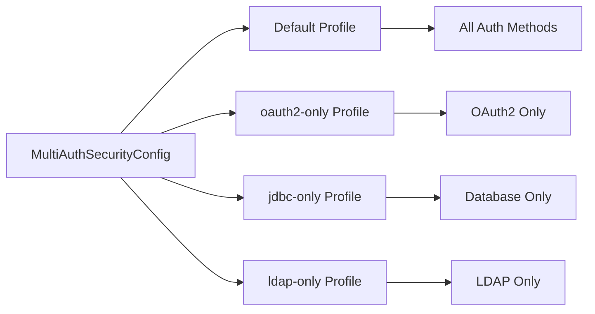
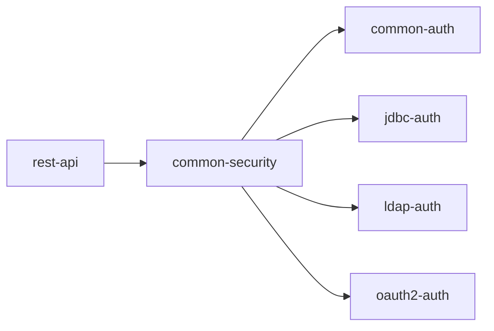

# Common Security Configuration

The `common-security` module provides the foundational security configuration for the entire project, implementing a sophisticated multi-provider authentication system.

## 🏗️ **Module Overview**

```yaml
Module: common-security
Purpose: Core security configuration and cross-cutting security concerns
Location: common-security/src/main/java/com/example/commonsecurity/
Key Files:
  - MultiAuthSecurityConfig.java    # Main security configuration
  - SecurityConfig.java             # Basic security setup
  - GrpcSecurityInterceptor.java    # gRPC security
  - WebSocketSecurityInterceptor.java # WebSocket security
```

## 🎯 **MultiAuthSecurityConfig**

The heart of our security configuration, supporting multiple authentication methods through Spring profiles.

### **Configuration Architecture**



### **Profile-Based Security Chains**

=== "Default Profile (All Methods)"

    ```java
    @Bean
    @Profile("!oauth2-only & !jdbc-only & !ldap-only")
    public SecurityFilterChain defaultFilterChain(HttpSecurity http) throws Exception {
        return http
            .csrf(csrf -> csrf.disable())
            .sessionManagement(session -> session.sessionCreationPolicy(STATELESS))
            .authorizeHttpRequests(authz -> authz
                .requestMatchers("/api/public/**", "/api/auth/**").permitAll()
                .requestMatchers("/oauth2/**", "/login/oauth2/**").permitAll()
                .requestMatchers("/api/admin/**").hasRole("ADMIN")
                .requestMatchers("/api/user/**").hasAnyRole("USER", "ADMIN")
                .requestMatchers("/api/jdbc/**").hasAnyRole("USER", "ADMIN")
                .requestMatchers("/api/ldap/**").hasAnyRole("USER", "ADMIN")
                .requestMatchers("/actuator/health").permitAll()
                .anyRequest().authenticated()
            )
            .authenticationProvider(customAuthenticationProvider)
            .authenticationProvider(jdbcAuthenticationProvider)
            .authenticationProvider(ldapAuthenticationProvider)
            .oauth2Login(oauth2 -> {
                oauth2.userInfoEndpoint(userInfo -> userInfo.userService(oauth2UserService));
                if (oauth2AuthenticationSuccessHandler != null) {
                    oauth2.successHandler(oauth2AuthenticationSuccessHandler);
                }
            })
            .addFilterBefore(jwtAuthenticationFilter, UsernamePasswordAuthenticationFilter.class)
            .build();
    }
    ```

=== "OAuth2-Only Profile"

    ```java
    @Bean
    @Profile("oauth2-only")
    public SecurityFilterChain oauth2OnlyFilterChain(HttpSecurity http) throws Exception {
        return http
            .csrf(csrf -> csrf.disable())
            .authorizeHttpRequests(authz -> authz
                .requestMatchers("/", "/login", "/oauth2/**", "/login/oauth2/**").permitAll()
                .anyRequest().authenticated()
            )
            .oauth2Login(oauth2 -> {
                if (oauth2UserService != null) {
                    oauth2.userInfoEndpoint(userInfo -> userInfo.userService(oauth2UserService));
                }
                if (oauth2AuthenticationSuccessHandler != null) {
                    oauth2.successHandler(oauth2AuthenticationSuccessHandler);
                }
            })
            .build();
    }
    ```

=== "JDBC-Only Profile"

    ```java
    @Bean
    @Profile("jdbc-only")
    public SecurityFilterChain jdbcOnlyFilterChain(HttpSecurity http) throws Exception {
        return http
            .csrf(csrf -> csrf.disable())
            .sessionManagement(session -> session.sessionCreationPolicy(IF_REQUIRED))
            .authorizeHttpRequests(authz -> authz
                .requestMatchers("/api/public/**", "/login", "/logout").permitAll()
                .anyRequest().authenticated()
            )
            .formLogin(form -> form
                .loginPage("/login")
                .permitAll()
            )
            .logout(logout -> logout.permitAll())
            .authenticationProvider(jdbcAuthenticationProvider)
            .build();
    }
    ```

=== "LDAP-Only Profile"

    ```java
    @Bean
    @Profile("ldap-only")
    public SecurityFilterChain ldapOnlyFilterChain(HttpSecurity http) throws Exception {
        return http
            .csrf(csrf -> csrf.disable())
            .sessionManagement(session -> session.sessionCreationPolicy(IF_REQUIRED))
            .authorizeHttpRequests(authz -> authz
                .requestMatchers("/api/public/**", "/login", "/logout").permitAll()
                .anyRequest().authenticated()
            )
            .formLogin(form -> form
                .loginPage("/login")
                .permitAll()
            )
            .logout(logout -> logout.permitAll())
            .authenticationProvider(ldapAuthenticationProvider)
            .build();
    }
    ```

## 🔧 **Security Configuration Details**

### **Authentication Providers**

| Provider | Purpose | Auto-Configuration |
|----------|---------|-------------------|
| `CustomAuthenticationProvider` | Session-based auth | Always available |
| `JdbcAuthenticationProvider` | Database users | Conditional (`@Autowired(required = false)`) |
| `LdapAuthenticationProvider` | Directory users | Conditional (`@Autowired(required = false)`) |
| `OAuth2UserService` | Social login | Conditional (`@Autowired(required = false)`) |

### **Security Features**

#### 🛡️ **CSRF Protection**
```java
// Disabled for API-first design
.csrf(csrf -> csrf.disable())
```

#### 🔐 **Session Management**
```java
// Stateless for default (JWT) profile
.sessionManagement(session -> session.sessionCreationPolicy(STATELESS))

// Stateful for form-based profiles  
.sessionManagement(session -> session.sessionCreationPolicy(IF_REQUIRED))
```

#### 🎯 **Authorization Rules**
```java
.authorizeHttpRequests(authz -> authz
    // Public endpoints
    .requestMatchers("/api/public/**", "/api/auth/**").permitAll()
    // OAuth2 endpoints
    .requestMatchers("/oauth2/**", "/login/oauth2/**").permitAll()
    // Role-based endpoints
    .requestMatchers("/api/admin/**").hasRole("ADMIN")
    .requestMatchers("/api/user/**").hasAnyRole("USER", "ADMIN")
    // Auth-method specific endpoints
    .requestMatchers("/api/jdbc/**").hasAnyRole("USER", "ADMIN")
    .requestMatchers("/api/ldap/**").hasAnyRole("USER", "ADMIN")
    // Health check
    .requestMatchers("/actuator/health").permitAll()
    // Everything else requires authentication
    .anyRequest().authenticated()
)
```

## 🌐 **Multi-Protocol Security**

### **gRPC Security Interceptor**
```java
@Bean
public GrpcSecurityInterceptor grpcSecurityInterceptor() {
    return new GrpcSecurityInterceptor();
}
```

Features:
- JWT token validation for gRPC calls
- Metadata-based authentication
- Status code mapping for security errors

### **WebSocket Security Interceptor**  
```java
@Bean  
public WebSocketSecurityInterceptor webSocketSecurityInterceptor() {
    return new WebSocketSecurityInterceptor();
}
```

Features:
- Channel-level message interception
- Session-based WebSocket authentication
- Real-time security validation

## 📋 **Configuration Properties**

### **Profile Activation**
```bash
# All authentication methods (default)
mvn spring-boot:run -pl rest-api

# OAuth2 only
mvn spring-boot:run -pl rest-api -Dspring-boot.run.profiles=oauth2-only

# Database authentication only  
mvn spring-boot:run -pl rest-api -Dspring-boot.run.profiles=jdbc-only

# LDAP authentication only
mvn spring-boot:run -pl rest-api -Dspring-boot.run.profiles=ldap-only
```

### **Security Configuration Override**
```yaml
# application.yml
spring:
  security:
    require-ssl: false  # Development only
    headers:
      frame-options: SAMEORIGIN
      content-type-options: nosniff
```

## 🎓 **Educational Highlights**

### **Key Learning Concepts**

1. **Profile-Based Configuration**: How to create environment-specific security setups
2. **Multi-Provider Authentication**: Combining different authentication mechanisms
3. **Filter Chain Integration**: Proper JWT filter positioning
4. **Conditional Dependencies**: Using `@Autowired(required = false)` for optional components
5. **Security Filter Ordering**: Understanding Spring Security's filter execution order

### **Best Practices Demonstrated**

✅ **Separation of Concerns**: Each authentication method in its own module  
✅ **Profile-Based Deployment**: Different security for different environments  
✅ **Defensive Programming**: Null checks for optional components  
✅ **Stateless Design**: JWT for APIs, sessions for web forms  
✅ **Role-Based Security**: Clear authorization rules  

## 🔗 **Integration Points**

### **Dependencies**
```xml
<dependency>
    <groupId>com.example</groupId>
    <artifactId>common-auth</artifactId>
    <version>${project.version}</version>
</dependency>
```

### **Module Interactions**


## 🚀 **Next Steps**

- **[Security Filter Chain →](filter-chain.md)** - Deep dive into filter implementation
- **[Authorization →](authorization.md)** - Role-based access control patterns
- **[Authentication Methods →](../authentication/index.md)** - Individual auth method details
- **[API Testing →](../examples/testing-auth.md)** - How to test security configurations

---

**💡 The multi-profile approach allows this single configuration to support everything from development environments to production deployments with different authentication requirements.**