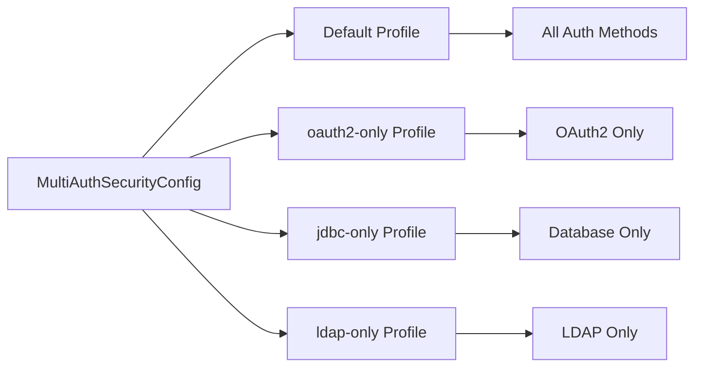

# Common Security Configuration

The `common-security` module provides the foundational security configuration for the entire project, implementing a sophisticated multi-provider authentication system.

## 🏗️ **Module Overview**

```yaml
Module: common-security
Purpose: Core security configuration and cross-cutting security concerns
Location: common-security/src/main/java/com/example/spring/security/reference/commonsecurity/
Key Files:
  - MultiAuthSecurityConfig.java    # Main security configuration (active)
  - SecurityConfig.java             # Legacy config (disabled via @Profile)
  - GrpcSecurityInterceptor.java    # gRPC security
  - WebSocketSecurityInterceptor.java # WebSocket security
```

## 🎯 **MultiAuthSecurityConfig**

The heart of our security configuration, supporting multiple authentication methods through Spring profiles.

### **Configuration Architecture**


```mermaid
graph LR
    A[MultiAuthSecurityConfig] --> B[Default Profile]
    A --> C[oauth2-only Profile]
    A --> D[jdbc-only Profile] 
    A --> E[ldap-only Profile]
    
    B --> F[All Auth Methods]
    C --> G[OAuth2 Only]
    D --> H[Database Only]
    E --> I[LDAP Only]
```

### **Profile-Based Security Chains**

=== "Default Profile (All Methods)"

    ```java
    @Bean
    @Profile("!oauth2-only & !jdbc-only & !ldap-only")
    public SecurityFilterChain defaultFilterChain(HttpSecurity http) throws Exception {
        http
            .csrf(csrf -> csrf.disable())
            .sessionManagement(session -> session.sessionCreationPolicy(STATELESS))
            .authorizeHttpRequests(authz -> authz
                // H2 console endpoints (for development)
                .requestMatchers(new AntPathRequestMatcher("/h2-console/**")).permitAll()
                // Public endpoints
                .requestMatchers(new AntPathRequestMatcher("/api/public/**")).permitAll()
                .requestMatchers(new AntPathRequestMatcher("/api/auth/**")).permitAll()
                // OAuth2 endpoints
                .requestMatchers(new AntPathRequestMatcher("/oauth2/**")).permitAll()
                .requestMatchers(new AntPathRequestMatcher("/login/oauth2/**")).permitAll()
                // Admin endpoints
                .requestMatchers(new AntPathRequestMatcher("/api/admin/**")).hasRole("ADMIN")
                // User endpoints
                .requestMatchers(new AntPathRequestMatcher("/api/user/**")).hasAnyRole("USER", "ADMIN")
                // Auth-specific endpoints
                .requestMatchers(new AntPathRequestMatcher("/api/jdbc/**")).hasAnyRole("USER", "ADMIN")
                .requestMatchers(new AntPathRequestMatcher("/api/ldap/**")).hasAnyRole("USER", "ADMIN")
                // Actuator endpoints
                .requestMatchers(new AntPathRequestMatcher("/actuator/health")).permitAll()
                .anyRequest().authenticated()
            )
            // Add all authentication providers
            .authenticationProvider(customAuthenticationProvider);

        // Add JDBC provider if available
        if (jdbcAuthenticationProvider != null) {
            http.authenticationProvider(jdbcAuthenticationProvider);
        }

        // Add LDAP provider if available
        if (ldapAuthenticationProvider != null) {
            http.authenticationProvider(ldapAuthenticationProvider);
        }

        // Add JWT filter before UsernamePasswordAuthenticationFilter
        http.addFilterBefore(jwtAuthenticationFilter, UsernamePasswordAuthenticationFilter.class);

        return http.build();
    }
    ```

    !!! note "OAuth2 Integration"
        OAuth2 configuration is currently commented out in the codebase. 
        To enable it, uncomment the `oauth2Login()` configuration block.

=== "OAuth2-Only Profile"

    ```java
    @Bean
    @Profile("oauth2-only")
    public SecurityFilterChain oauth2OnlyFilterChain(HttpSecurity http) throws Exception {
        http
            .csrf(csrf -> csrf.disable())
            .authorizeHttpRequests(authz -> authz
                .requestMatchers("/", "/login", "/oauth2/**", "/login/oauth2/**").permitAll()
                .anyRequest().authenticated()
            );
            // OAuth2 login configuration (currently commented out)
            // .oauth2Login(oauth2 -> { ... });

        return http.build();
    }
    ```

=== "JDBC-Only Profile"

    ```java
    @Bean
    @Profile("jdbc-only")
    public SecurityFilterChain jdbcOnlyFilterChain(HttpSecurity http) throws Exception {
        http
            .csrf(csrf -> csrf.disable())
            .sessionManagement(session -> session.sessionCreationPolicy(IF_REQUIRED))
            .authorizeHttpRequests(authz -> authz
                .requestMatchers("/api/public/**", "/login", "/logout").permitAll()
                .anyRequest().authenticated()
            )
            .formLogin(form -> form
                .loginPage("/login")
                .permitAll()
            )
            .logout(logout -> logout.permitAll());

        if (jdbcAuthenticationProvider != null) {
            http.authenticationProvider(jdbcAuthenticationProvider);
        }

        return http.build();
    }
    ```

=== "LDAP-Only Profile"

    ```java
    @Bean
    @Profile("ldap-only")
    public SecurityFilterChain ldapOnlyFilterChain(HttpSecurity http) throws Exception {
        http
            .csrf(csrf -> csrf.disable())
            .sessionManagement(session -> session.sessionCreationPolicy(IF_REQUIRED))
            .authorizeHttpRequests(authz -> authz
                .requestMatchers("/api/public/**", "/login", "/logout").permitAll()
                .anyRequest().authenticated()
            )
            .formLogin(form -> form
                .loginPage("/login")
                .permitAll()
            )
            .logout(logout -> logout.permitAll());

        if (ldapAuthenticationProvider != null) {
            http.authenticationProvider(ldapAuthenticationProvider);
        }

        return http.build();
    }
    ```

## 🔧 **Security Configuration Details**

### **Authentication Providers**

| Provider | Purpose | Auto-Configuration |
|----------|---------|-------------------|
| `CustomAuthenticationProvider` | Session-based auth with hardcoded users | Always available |
| `DaoAuthenticationProvider` (JDBC) | Database users via `JdbcUserDetailsManager` | Conditional (`@Autowired(required = false)`) |
| `AuthenticationProvider` (LDAP) | Directory users | Conditional (`@Autowired(required = false)`) |

### **Injected Dependencies**

```java
@Autowired
private CustomAuthenticationProvider customAuthenticationProvider;

@Autowired(required = false)
private DaoAuthenticationProvider jdbcAuthenticationProvider;

@Autowired(required = false)
private AuthenticationProvider ldapAuthenticationProvider;

@Autowired
private JwtAuthenticationFilter jwtAuthenticationFilter;
```

### **Security Features**

#### 🛡️ **CSRF Protection**
```java
// Disabled for API-first design (stateless JWT authentication)
.csrf(csrf -> csrf.disable())
```

#### 🔐 **Session Management**
```java
// Stateless for default (JWT) profile
.sessionManagement(session -> session.sessionCreationPolicy(SessionCreationPolicy.STATELESS))

// Stateful for form-based profiles (jdbc-only, ldap-only)
.sessionManagement(session -> session.sessionCreationPolicy(SessionCreationPolicy.IF_REQUIRED))
```

#### 🎯 **Authorization Rules**
```java
.authorizeHttpRequests(authz -> authz
    // Development endpoints
    .requestMatchers(new AntPathRequestMatcher("/h2-console/**")).permitAll()
    // Public endpoints
    .requestMatchers(new AntPathRequestMatcher("/api/public/**")).permitAll()
    .requestMatchers(new AntPathRequestMatcher("/api/auth/**")).permitAll()
    // OAuth2 endpoints
    .requestMatchers(new AntPathRequestMatcher("/oauth2/**")).permitAll()
    .requestMatchers(new AntPathRequestMatcher("/login/oauth2/**")).permitAll()
    // Role-based endpoints
    .requestMatchers(new AntPathRequestMatcher("/api/admin/**")).hasRole("ADMIN")
    .requestMatchers(new AntPathRequestMatcher("/api/user/**")).hasAnyRole("USER", "ADMIN")
    // Auth-method specific endpoints
    .requestMatchers(new AntPathRequestMatcher("/api/jdbc/**")).hasAnyRole("USER", "ADMIN")
    .requestMatchers(new AntPathRequestMatcher("/api/ldap/**")).hasAnyRole("USER", "ADMIN")
    // Health check
    .requestMatchers(new AntPathRequestMatcher("/actuator/health")).permitAll()
    // Everything else requires authentication
    .anyRequest().authenticated()
)
```

## 🌐 **Multi-Protocol Security**

### **gRPC Security Interceptor**

```java
@Bean
public GrpcSecurityInterceptor grpcSecurityInterceptor() {
    return new GrpcSecurityInterceptor();
}
```

Features:
- JWT token validation for gRPC calls
- Extracts token from `Authorization` metadata header
- Validates `Bearer ` prefix requirement
- Closes call with `Status.UNAUTHENTICATED` for invalid tokens

### **WebSocket Security Interceptor**

```java
@Bean  
public WebSocketSecurityInterceptor webSocketSecurityInterceptor() {
    return new WebSocketSecurityInterceptor();
}
```

Features:
- Implements `ChannelInterceptor` interface
- Security logic in `preSend()` method
- Currently allows all messages (extend for JWT validation)

## 📝 **Legacy SecurityConfig**

The original `SecurityConfig.java` is disabled via profile annotation:

```java
@Configuration
@EnableWebSecurity
@Profile("disabled-legacy-config")  // Disabled in favor of MultiAuthSecurityConfig
public class SecurityConfig {
    // ... legacy configuration
}
```

This configuration is preserved for reference but not active in the application.

## 🔗 **Related Topics**

- [Security Filter Chain](filter-chain.md)
- [JWT Tokens](../authentication/jwt-tokens.md)
- [JDBC Authentication](../authentication/jdbc-auth.md)
- [LDAP Authentication](../authentication/ldap-auth.md)
