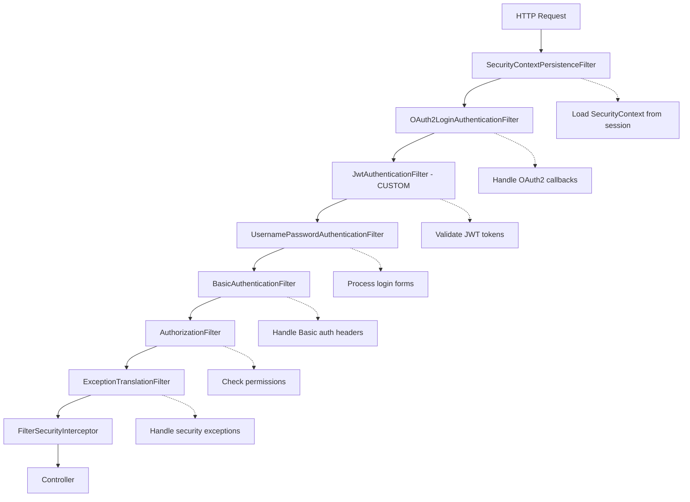
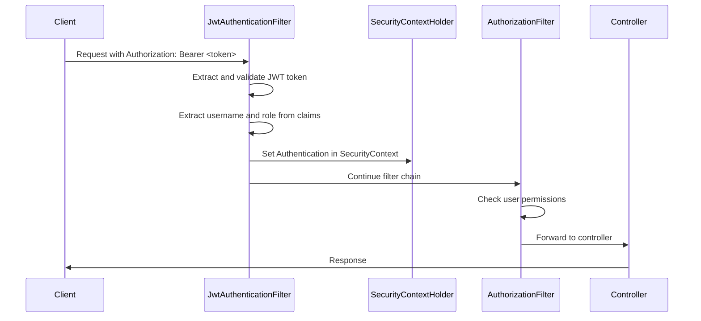
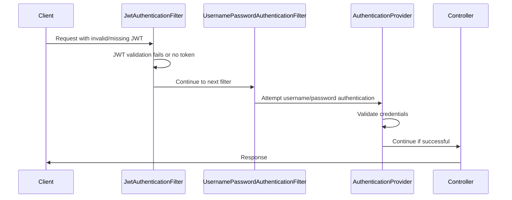

# Security Filter Chain

Understanding Spring Security's filter chain is crucial for implementing custom authentication flows. This guide explores the filter chain architecture and custom filter integration in our reference project.

## 🔗 **Filter Chain Architecture**

### **Spring Security Filter Execution Order**



### **Filter Chain Configuration**

Our security configuration carefully orchestrates multiple filters to support different authentication methods:

```java
@Bean
public SecurityFilterChain defaultFilterChain(HttpSecurity http) throws Exception {
    return http
        // ... other configuration
        
        // JWT Filter positioned BEFORE UsernamePasswordAuthenticationFilter
        .addFilterBefore(jwtAuthenticationFilter, UsernamePasswordAuthenticationFilter.class)
        
        // Multiple authentication providers
        .authenticationProvider(customAuthenticationProvider)
        .authenticationProvider(jdbcAuthenticationProvider)  
        .authenticationProvider(ldapAuthenticationProvider)
        
        .build();
}
```

## 🎯 **Custom JWT Authentication Filter**

### **Implementation Details**

```java
@Component
public class JwtAuthenticationFilter extends OncePerRequestFilter {

    @Autowired
    private JwtTokenUtil jwtTokenUtil;

    @Override
    protected void doFilterInternal(HttpServletRequest request,
                                    HttpServletResponse response,
                                    FilterChain chain) throws ServletException, IOException {

        String header = request.getHeader("Authorization");
        String jwtToken = null;
        String username = null;

        // Extract JWT token from Authorization header
        if (header != null && header.startsWith("Bearer ")) {
            jwtToken = header.substring(7);
            try {
                Claims claims = jwtTokenUtil.getClaimsFromToken(jwtToken);
                username = claims.getSubject();
                String role = claims.get("role", String.class);

                if (username != null && SecurityContextHolder.getContext().getAuthentication() == null) {
                    // Create authorities from role
                    List<SimpleGrantedAuthority> authorities = List.of(
                        new SimpleGrantedAuthority(role)
                    );
                    
                    // Create authentication token
                    UsernamePasswordAuthenticationToken authToken =
                            new UsernamePasswordAuthenticationToken(username, null, authorities);
                    authToken.setDetails(new WebAuthenticationDetailsSource().buildDetails(request));
                    
                    // Set authentication in SecurityContext
                    SecurityContextHolder.getContext().setAuthentication(authToken);
                }
            } catch (Exception e) {
                logger.debug("Invalid JWT token: " + e.getMessage());
            }
        }
        
        // Continue filter chain
        chain.doFilter(request, response);
    }
}
```

### **Filter Positioning Strategy**

```java
// JWT filter runs BEFORE form-based authentication
.addFilterBefore(jwtAuthenticationFilter, UsernamePasswordAuthenticationFilter.class)
```

**Why this positioning?**
- JWT tokens should be processed before attempting form-based authentication
- Allows stateless JWT authentication to take precedence
- Enables fallback to other authentication methods if JWT is invalid

## 🛡️ **Filter Chain Execution Flow**

### **Successful JWT Authentication**



### **Failed JWT Authentication with Fallback**



## 📋 **Filter Configuration by Profile**

### **Default Profile Filter Chain**

```java
@Profile("!oauth2-only & !jdbc-only & !ldap-only")
public SecurityFilterChain defaultFilterChain(HttpSecurity http) {
    // Supports ALL authentication methods:
    // 1. JWT tokens (custom filter)
    // 2. OAuth2 login (built-in filter)  
    // 3. Database authentication (provider)
    // 4. LDAP authentication (provider)
    // 5. Custom authentication (provider)
}
```

### **OAuth2-Only Profile Filter Chain**

```java
@Profile("oauth2-only")  
public SecurityFilterChain oauth2OnlyFilterChain(HttpSecurity http) {
    // Only OAuth2 authentication:
    // - OAuth2LoginAuthenticationFilter (built-in)
    // - No custom JWT filter
    // - No other authentication providers
}
```

### **JDBC/LDAP-Only Profile Filter Chain**

```java
@Profile("jdbc-only") // or "ldap-only"
public SecurityFilterChain jdbcOnlyFilterChain(HttpSecurity http) {
    // Form-based authentication only:
    // - UsernamePasswordAuthenticationFilter (built-in)
    // - Single authentication provider (JDBC or LDAP)
    // - Session-based security context
}
```

## 🔍 **Filter Chain Debugging**

### **Logging Configuration**

Enable detailed filter chain logging:

```yaml
# application.yml
logging:
  level:
    org.springframework.security: DEBUG
    org.springframework.security.web.FilterChainProxy: DEBUG
    com.example.commonauth.JwtAuthenticationFilter: DEBUG
```

### **Filter Chain Analysis**

Spring Security provides filter chain information at startup:

```
2024-01-15 10:30:15.123  INFO 12345 --- [main] o.s.s.web.DefaultSecurityFilterChain     
: Will secure any request with filters:
  SecurityContextPersistenceFilter
  OAuth2LoginAuthenticationFilter  
  JwtAuthenticationFilter (CUSTOM)
  UsernamePasswordAuthenticationFilter
  DefaultLoginPageGeneratingFilter
  DefaultLogoutPageGeneratingFilter  
  BasicAuthenticationFilter
  RequestCacheAwareFilter
  SecurityContextHolderAwareRequestFilter
  AnonymousAuthenticationFilter
  SessionManagementFilter
  ExceptionTranslationFilter
  AuthorizationFilter
```

## 🎯 **Custom Filter Best Practices**

### **1. Extend OncePerRequestFilter**

```java
@Component
public class JwtAuthenticationFilter extends OncePerRequestFilter {
    // Ensures filter runs only once per request
    // Handles async dispatches properly
}
```

### **2. Null-Safe Authentication Checks**

```java
// Only set authentication if none exists
if (username != null && SecurityContextHolder.getContext().getAuthentication() == null) {
    // Set authentication
}
```

### **3. Proper Exception Handling**

```java
try {
    // Token validation logic
} catch (Exception e) {
    // Log but don't fail - let other filters try
    logger.debug("Invalid JWT token: " + e.getMessage());
}
// Always continue filter chain
chain.doFilter(request, response);
```

### **4. Security Context Management**

```java
// Create authentication with proper details
UsernamePasswordAuthenticationToken authToken =
        new UsernamePasswordAuthenticationToken(username, null, authorities);
authToken.setDetails(new WebAuthenticationDetailsSource().buildDetails(request));

// Set in SecurityContextHolder for this request
SecurityContextHolder.getContext().setAuthentication(authToken);
```

## 🔒 **Multi-Protocol Filter Integration**

### **gRPC Security Interceptor**

```java
@Component
public class GrpcSecurityInterceptor implements ServerInterceptor {
    
    @Override
    public <ReqT, RespT> ServerCall.Listener<ReqT> interceptCall(
            ServerCall<ReqT, RespT> call,
            Metadata headers,
            ServerCallHandler<ReqT, RespT> next) {
        
        // Extract JWT from gRPC metadata
        String authorization = headers.get(Metadata.Key.of("authorization", ASCII_STRING_MARSHALLER));
        
        if (authorization != null && authorization.startsWith("Bearer ")) {
            // Validate JWT and set security context
            // Similar to HTTP JWT filter logic
        }
        
        return next.startCall(call, headers);
    }
}
```

### **WebSocket Security Interceptor**

```java
@Component
public class WebSocketSecurityInterceptor implements ChannelInterceptor {
    
    @Override
    public Message<?> preSend(Message<?> message, MessageChannel channel) {
        // WebSocket message-level security
        // Can validate JWT tokens in WebSocket messages
        return message;
    }
}
```

## 📚 **Educational Concepts**

### **Filter vs Provider**

| Component | Purpose | When to Use |
|-----------|---------|-------------|
| **Filter** | Process requests/responses | Custom token validation, header processing |
| **Provider** | Authenticate credentials | Database lookups, external service calls |

### **Filter Ordering**

```java
// Critical ordering principles:
// 1. Authentication filters before authorization
// 2. Custom filters before built-in equivalents  
// 3. Token-based before credential-based
// 4. Stateless before stateful

.addFilterBefore(jwtAuthenticationFilter, UsernamePasswordAuthenticationFilter.class)
```

### **SecurityContext Lifecycle**

1. **Request Start**: SecurityContext loaded from session (if exists)
2. **Filter Chain**: Filters populate authentication
3. **Authorization**: Access control decisions made
4. **Request End**: SecurityContext cleared (stateless) or saved (stateful)

## 🚀 **Next Steps**

- **[Authorization →](authorization.md)** - Role-based access control after authentication
- **[JWT Authentication →](../authentication/jwt-tokens.md)** - Detailed JWT implementation
- **[Testing Security →](../examples/testing-auth.md)** - How to test filter chains
- **[API Reference →](../api/auth-flow.md)** - Authentication flow documentation

---

**💡 The filter chain is where authentication happens, but authorization decisions are made later in the process. Understanding this separation is key to Spring Security mastery.**