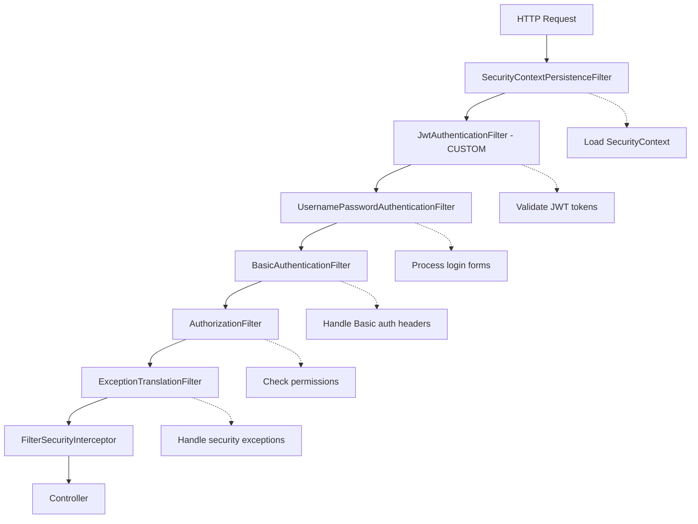
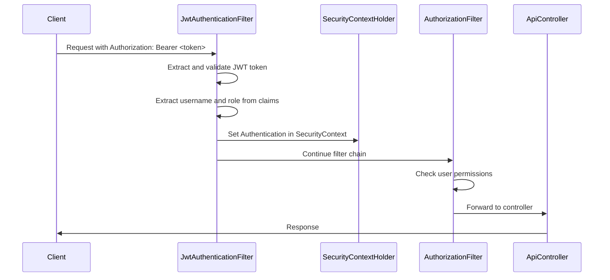
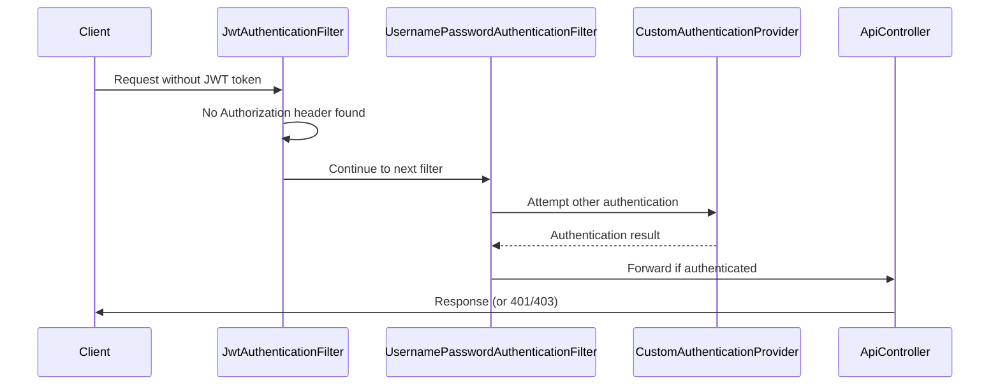

# Security Filter Chain

Understanding Spring Security's filter chain is crucial for implementing custom authentication flows. This guide explores the filter chain architecture and custom filter integration in our reference project.

## 🔗 **Filter Chain Architecture**

### **Spring Security Filter Execution Order**


```mermaid
graph TD
    A[HTTP Request] --> B[SecurityContextPersistenceFilter]
    B --> C[JwtAuthenticationFilter - CUSTOM]
    C --> D[UsernamePasswordAuthenticationFilter]
    D --> E[BasicAuthenticationFilter]
    E --> F[AuthorizationFilter]
    F --> G[ExceptionTranslationFilter]
    G --> H[FilterSecurityInterceptor]
    H --> I[Controller]
    
    B -.-> J[Load SecurityContext]
    C -.-> K[Validate JWT tokens]
    D -.-> L[Process login forms]
    E -.-> M[Handle Basic auth headers]
    F -.-> N[Check permissions]
    G -.-> O[Handle security exceptions]
```

### **Filter Chain Configuration**

Our security configuration in `MultiAuthSecurityConfig` orchestrates multiple filters to support different authentication methods:

```java
@Bean
@Profile("!oauth2-only & !jdbc-only & !ldap-only")
public SecurityFilterChain defaultFilterChain(HttpSecurity http) throws Exception {
    http
        .csrf(csrf -> csrf.disable())
        .sessionManagement(session -> session.sessionCreationPolicy(SessionCreationPolicy.STATELESS))
        .authorizeHttpRequests(authz -> authz
            // H2 console endpoints (for development)
            .requestMatchers(new AntPathRequestMatcher("/h2-console/**")).permitAll()
            // Public endpoints
            .requestMatchers(new AntPathRequestMatcher("/api/public/**")).permitAll()
            .requestMatchers(new AntPathRequestMatcher("/api/auth/**")).permitAll()
            // Role-based endpoints
            .requestMatchers(new AntPathRequestMatcher("/api/admin/**")).hasRole("ADMIN")
            .requestMatchers(new AntPathRequestMatcher("/api/user/**")).hasAnyRole("USER", "ADMIN")
            .requestMatchers(new AntPathRequestMatcher("/api/jdbc/**")).hasAnyRole("USER", "ADMIN")
            .requestMatchers(new AntPathRequestMatcher("/api/ldap/**")).hasAnyRole("USER", "ADMIN")
            .requestMatchers(new AntPathRequestMatcher("/actuator/health")).permitAll()
            .anyRequest().authenticated()
        )
        // Add authentication providers
        .authenticationProvider(customAuthenticationProvider);

    // Conditionally add JDBC/LDAP providers if available
    if (jdbcAuthenticationProvider != null) {
        http.authenticationProvider(jdbcAuthenticationProvider);
    }
    if (ldapAuthenticationProvider != null) {
        http.authenticationProvider(ldapAuthenticationProvider);
    }

    // JWT Filter positioned BEFORE UsernamePasswordAuthenticationFilter
    http.addFilterBefore(jwtAuthenticationFilter, UsernamePasswordAuthenticationFilter.class);

    return http.build();
}
```

## 🎯 **Custom JWT Authentication Filter**

### **Implementation Details**

The `JwtAuthenticationFilter` in `common-auth` module extracts and validates JWT tokens:

```java
package com.example.spring.security.reference.commonauth;

@Component
public class JwtAuthenticationFilter extends OncePerRequestFilter {

    @Autowired
    private JwtTokenUtil jwtTokenUtil;

    @Override
    protected void doFilterInternal(HttpServletRequest request,
                                    HttpServletResponse response,
                                    FilterChain chain) throws ServletException, IOException {

        String header = request.getHeader("Authorization");
        String jwtToken = null;
        String username = null;

        // Extract JWT token from Authorization header
        if (header != null && header.startsWith("Bearer ")) {
            jwtToken = header.substring(7);
            try {
                Claims claims = jwtTokenUtil.getClaimsFromToken(jwtToken);
                username = claims.getSubject();
                String role = claims.get("role", String.class);

                if (username != null && SecurityContextHolder.getContext().getAuthentication() == null) {
                    // Create authorities from role
                    List<SimpleGrantedAuthority> authorities = List.of(
                        new SimpleGrantedAuthority(role)
                    );
                    
                    // Create authentication token
                    UsernamePasswordAuthenticationToken authToken =
                            new UsernamePasswordAuthenticationToken(username, null, authorities);
                    authToken.setDetails(new WebAuthenticationDetailsSource().buildDetails(request));
                    
                    // Set authentication in SecurityContext
                    SecurityContextHolder.getContext().setAuthentication(authToken);
                }
            } catch (Exception e) {
                // Invalid token - continue without authentication
                logger.debug("Invalid JWT token: " + e.getMessage());
            }
        }
        
        // Continue filter chain
        chain.doFilter(request, response);
    }
}
```

### **Filter Positioning Strategy**

```java
// JWT filter runs BEFORE form-based authentication
.addFilterBefore(jwtAuthenticationFilter, UsernamePasswordAuthenticationFilter.class)
```

**Why this positioning?**

| Reason | Explanation |
|--------|-------------|
| **Priority** | JWT tokens should be processed before attempting form-based authentication |
| **Stateless** | Allows stateless JWT authentication to take precedence |
| **Fallback** | Enables fallback to other authentication methods if JWT is invalid/missing |

## 🛡️ **Filter Chain Execution Flow**

### **Successful JWT Authentication**


```mermaid
sequenceDiagram
    participant C as Client
    participant F as JwtAuthenticationFilter
    participant S as SecurityContextHolder
    participant A as AuthorizationFilter
    participant R as ApiController

    C->>F: Request with Authorization: Bearer <token>
    F->>F: Extract and validate JWT token
    F->>F: Extract username and role from claims
    F->>S: Set Authentication in SecurityContext
    F->>A: Continue filter chain
    A->>A: Check user permissions
    A->>R: Forward to controller
    R->>C: Response
```

### **Request Without JWT (Fallback)**


```mermaid
sequenceDiagram
    participant C as Client
    participant F as JwtAuthenticationFilter
    participant U as UsernamePasswordAuthenticationFilter
    participant P as CustomAuthenticationProvider
    participant R as ApiController

    C->>F: Request without JWT token
    F->>F: No Authorization header found
    F->>U: Continue to next filter
    U->>P: Attempt other authentication
    P-->>U: Authentication result
    U->>R: Forward if authenticated
    R->>C: Response (or 401/403)
```

## 🔐 **JwtTokenUtil - Token Generation**

The `JwtTokenUtil` class uses secure key generation:

```java
@Component
public class JwtTokenUtil {
    // Secure 512-bit key for HS512 algorithm
    private static final SecretKey SECRET_KEY = Keys.secretKeyFor(SignatureAlgorithm.HS512);
    private static final long EXPIRATION_TIME = 86400000; // 24 hours

    public String generateToken(String username, String role) {
        return Jwts.builder()
                .setSubject(username)
                .claim("role", role)
                .setIssuedAt(new Date())
                .setExpiration(new Date(System.currentTimeMillis() + EXPIRATION_TIME))
                .signWith(SignatureAlgorithm.HS512, SECRET_KEY)
                .compact();
    }

    public Claims getClaimsFromToken(String token) {
        return Jwts.parser()
                .setSigningKey(SECRET_KEY)
                .parseClaimsJws(token)
                .getBody();
    }
}
```

!!! warning "Key Regeneration"
    The secret key is regenerated on each application restart, invalidating all 
    previously issued tokens. For production, use a persistent key.

## 🎓 **Learning Points**

| Concept | Description |
|---------|-------------|
| **OncePerRequestFilter** | Ensures filter executes only once per request |
| **SecurityContextHolder** | Thread-local storage for authentication information |
| **Filter Order** | Critical for correct authentication flow |
| **Stateless Sessions** | No server-side session storage with JWT |

## 🔗 **Related Topics**

- [JWT Tokens](../authentication/jwt-tokens.md)
- [Common Security Configuration](common-security.md)
- [REST Endpoints](../api/rest-endpoints.md)
