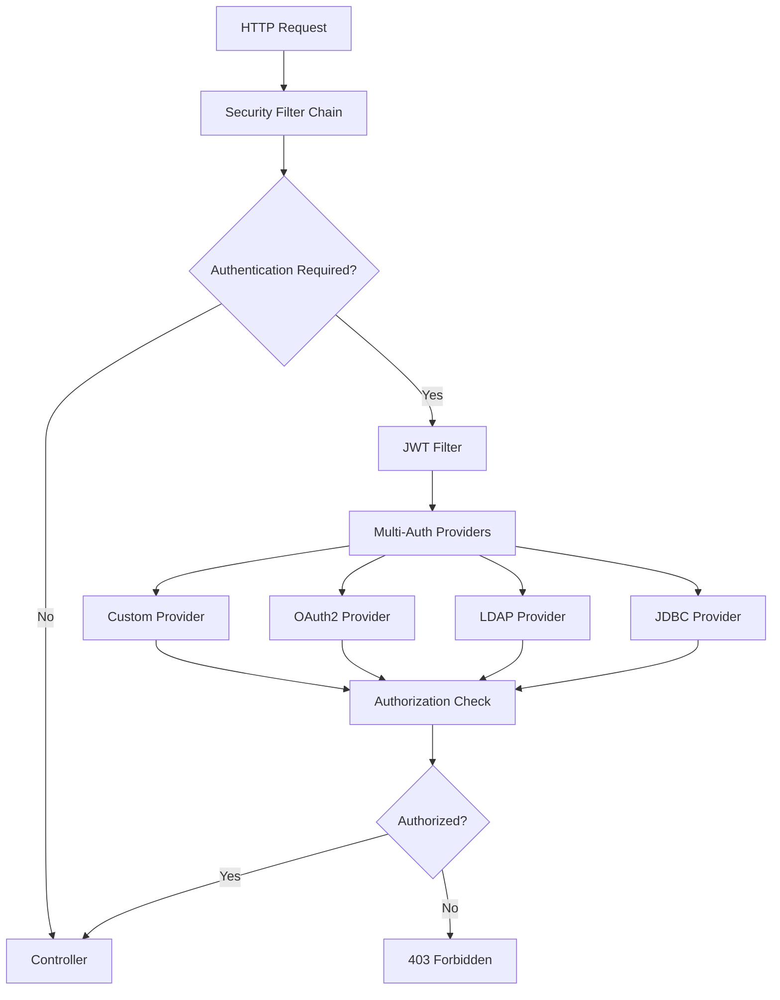

# Security Configuration

This section covers the comprehensive security configuration patterns implemented in the Spring Security Reference project.

## 🏗️ **Security Architecture Overview**

Our security configuration follows a **layered, multi-provider architecture** designed to demonstrate enterprise-grade Spring Security patterns:



## 🔧 **Configuration Modules**

| Module | Purpose | Key Components |
|--------|---------|----------------|
| **common-security** | Core security configuration | `MultiAuthSecurityConfig`, interceptors |
| **common-auth** | Authentication utilities | JWT filters, custom providers |
| **authorization-service** | Role & permission logic | Authorization service, role management |

## 📋 **Security Configuration Topics**

### 🛡️ [Common Security Configuration](common-security.md)
- Multi-provider authentication setup
- Profile-based security configurations
- Cross-cutting security concerns

### ⛓️ [Security Filter Chain](filter-chain.md)
- Filter ordering and execution
- Custom filter integration
- JWT authentication flow

### 🔐 [Authorization & Access Control](authorization.md)
- Role-based access control (RBAC)
- Method-level security
- Custom authorization logic

## 🎯 **Key Security Features**

### **Multi-Authentication Support**
```java
@Configuration
@EnableWebSecurity
public class MultiAuthSecurityConfig {
    
    @Bean
    public SecurityFilterChain defaultFilterChain(HttpSecurity http) {
        return http
            .authenticationProvider(customAuthenticationProvider)
            .authenticationProvider(jdbcAuthenticationProvider)  
            .authenticationProvider(ldapAuthenticationProvider)
            .addFilterBefore(jwtAuthenticationFilter, 
                UsernamePasswordAuthenticationFilter.class)
            .build();
    }
}
```

### **Profile-Based Configuration**
- **Default Profile**: All authentication methods enabled
- **`jdbc-only`**: Database authentication only
- **`ldap-only`**: LDAP authentication only  
- **`oauth2-only`**: Social login only

### **Security Endpoints**
```yaml
Authorization Rules:
  Public Access:
    - /api/public/**     # No authentication required
    - /api/auth/**       # Login endpoints
    - /actuator/health   # Health checks
    
  Role-Based Access:
    - /api/admin/**      # ROLE_ADMIN required
    - /api/user/**       # ROLE_USER or ROLE_ADMIN
    - /api/jdbc/**       # Database auth endpoints
    - /api/ldap/**       # LDAP auth endpoints
```

## 🔒 **Security Best Practices Demonstrated**

### ✅ **Authentication**
- **JWT Token Security**: Stateless authentication with secure token validation
- **Password Encoding**: BCrypt hashing for database credentials
- **Session Management**: Configurable session policies per profile
- **CSRF Protection**: Disabled for APIs, configurable for web forms

### ✅ **Authorization**  
- **Role Hierarchy**: Admin inherits user permissions
- **Method Security**: `@PreAuthorize` and `@Secured` annotations
- **Path-Based Security**: URL pattern matching for access control
- **Custom Authorization**: Business logic-based authorization rules

### ✅ **Security Headers**
- **CORS Configuration**: Cross-origin request handling
- **Content Security Policy**: XSS protection headers
- **Secure Headers**: X-Frame-Options, X-Content-Type-Options

## 🎓 **Learning Objectives**

By studying this security configuration, you'll learn:

1. **Multi-Provider Setup** - How to configure multiple authentication methods
2. **Filter Chain Design** - Proper ordering and custom filter integration  
3. **Profile-Based Config** - Environment-specific security configurations
4. **Authorization Patterns** - Role-based and method-level security
5. **Security Testing** - How to test different authentication flows

## 🚀 **Quick Navigation**

- **[Common Security →](common-security.md)** - Core security configuration patterns
- **[Filter Chain →](filter-chain.md)** - Security filter implementation details  
- **[Authorization →](authorization.md)** - Access control and role management
- **[Authentication →](../authentication/index.md)** - Authentication method details
- **[API Reference →](../api/index.md)** - Secured endpoint documentation

---

**🎯 Start with [Common Security Configuration](common-security.md) to understand the foundation of our security setup.**