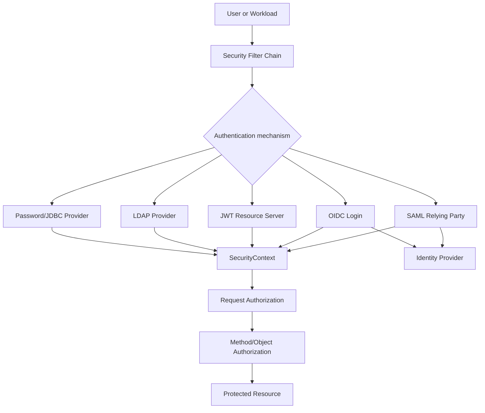
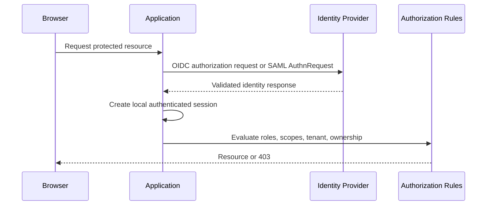

# Security Configuration

This section connects Spring Security configuration to authentication, authorization, federation, and executable labs. Check the [Coverage Registry](../coverage.md): several advanced mechanisms, including SSO and SAML, remain Theory or Planned until their tests pass.

## Security architecture


```mermaid
graph TD
    U[User or Workload] --> F[Security Filter Chain]
    F --> A{Authentication mechanism}
    A --> P[Password/JDBC Provider]
    A --> L[LDAP Provider]
    A --> J[JWT Resource Server]
    A --> O[OIDC Login]
    A --> S[SAML Relying Party]
    P --> C[SecurityContext]
    L --> C
    J --> C
    O --> C
    S --> C
    C --> R[Request Authorization]
    R --> M[Method/Object Authorization]
    M --> X[Protected Resource]
    O --> I[Identity Provider]
    S --> I
```

The active code currently demonstrates custom, JDBC, LDAP, and custom JWT paths. OIDC SSO, SAML SSO, the standard JWT resource server, and several browser protections are represented in documentation and the lab backlog but are not yet verified implementations.

## Configuration topics

### [Common Security Configuration](common-security.md)

- `SecurityFilterChain` construction
- Provider registration
- Session policy by profile
- Cross-cutting REST, gRPC, and WebSocket scaffolding

### [Security Filter Chain](filter-chain.md)

- Request matching and ordering
- Authentication filter placement
- Anonymous, unauthenticated, and authenticated requests
- 401 versus 403 behavior

### [Authorization and Access Control](authorization.md)

- Request and role authorization
- Method security
- Permission and ownership decisions
- Required positive and negative tests

### [Single Sign-On with OIDC and SAML](../authentication/sso-integration.md)

- SSO as an outcome rather than a protocol
- OIDC and SAML trust models
- Separate IdP and application sessions
- Local, provider, and coordinated logout
- Claim and attribute mapping
- Key/certificate rotation and outage handling

SSO is currently **Theory**. Complete LAB-010 through LAB-020, especially the two-client OIDC SSO and SAML relying-party labs, before marking it Verified.

## SSO in the security chain

SSO does not bypass Spring Security authorization. OIDC login or SAML login establishes an authenticated `SecurityContext`; request, method, tenant, and object rules must still authorize access.


```mermaid
sequenceDiagram
    participant U as Browser
    participant A as Application
    participant I as Identity Provider
    participant Z as Authorization Rules
    U->>A: Request protected resource
    A->>I: OIDC authorization request or SAML AuthnRequest
    I-->>A: Validated identity response
    A->>A: Create local authenticated session
    A->>Z: Evaluate roles, scopes, tenant, ownership
    Z-->>U: Resource or 403
```

The IdP proves an authentication event under an agreed trust policy. The application remains responsible for local authorization and session security.

## Mechanism status

| Mechanism | Status | Evidence or next lab |
|---|---|---|
| Request authorization | Implemented | LAB-001 verifies the production chain |
| Custom/JDBC/LDAP providers | Implemented | LAB-002 and LAB-003 add credential tests |
| Method security | Theory | LAB-004 |
| Sessions and CSRF | Theory | LAB-006 and LAB-007 |
| CORS and headers | Planned | LAB-008 |
| Standard JWT resource server | Theory | LAB-009 |
| OIDC login | Theory | LAB-010 through LAB-015 |
| OIDC SSO | Theory | LAB-016 |
| SAML SSO | Theory | LAB-017 through LAB-020 |
| Service identity and delegation | Planned | LAB-021 through LAB-028 |

## Security rules

- Prefer standard Spring Security DSLs over custom token or federation filters.
- Validate the credential at the boundary and authorize at the resource-owning layer.
- Do not convert external groups or attributes to privileged roles without an allow list.
- Keep browser sessions protected by secure cookies, session rotation, and CSRF defenses.
- Validate issuer, audience, signature, algorithm, and time for tokens.
- Validate issuer, destination, audience, recipient, signature, correlation, and time for SAML assertions.
- Never log passwords, tokens, authorization codes, assertions, cookies, or private keys.
- Document local versus IdP/global logout accurately.

## Learning and verification

1. Complete [Spring Security foundations](../labs.md#track-a-spring-security-foundations).
2. Implement [OAuth2 and OIDC](../labs.md#track-b-oauth2-oidc-and-token-security).
3. Prove [SSO and SAML](../labs.md#track-c-sso-and-saml-20).
4. Continue with microservice identity and protocol-specific security.

Run:

```bash
./gradlew test
uv run --with-requirements requirements.txt mkdocs build --strict
```

Continue with the [SSO guide](../authentication/sso-integration.md), [Learning Path](../learning-path.md), and [Coverage Registry](../coverage.md).
